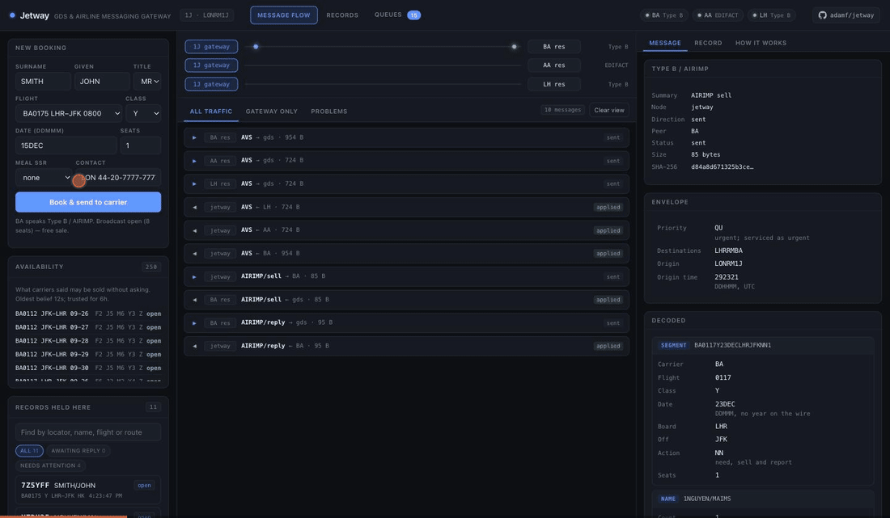
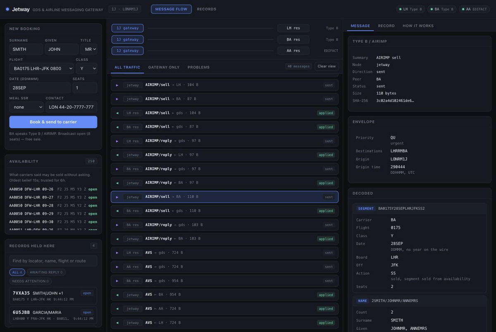
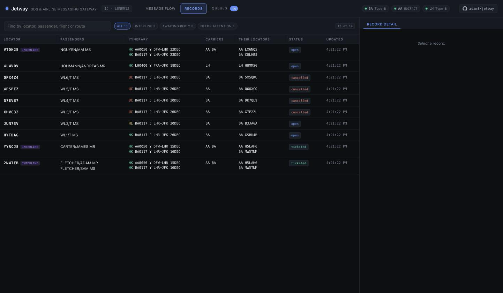
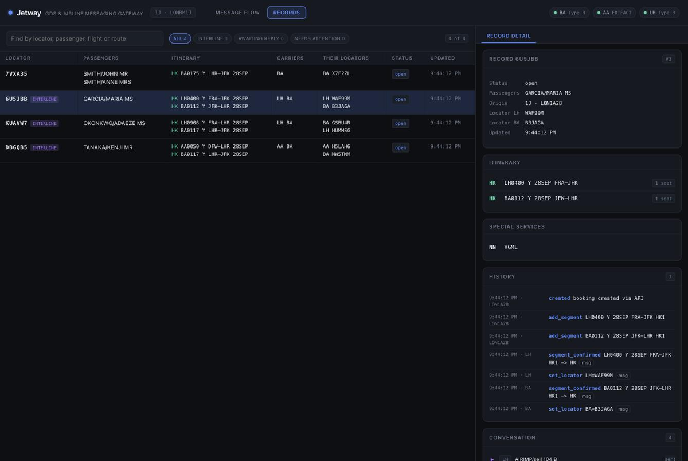
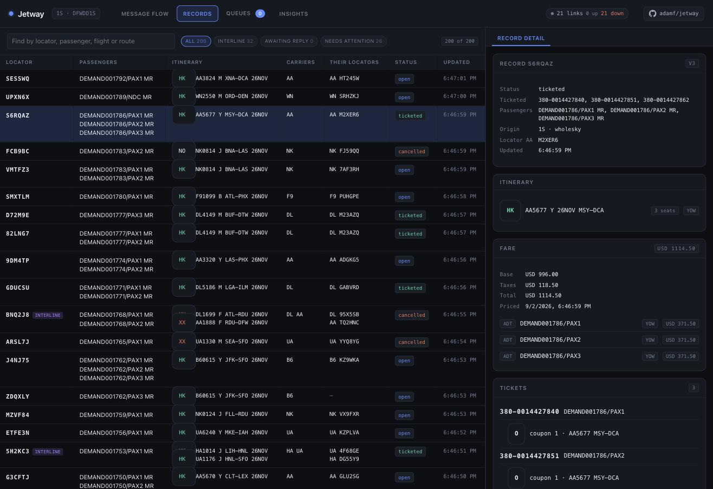
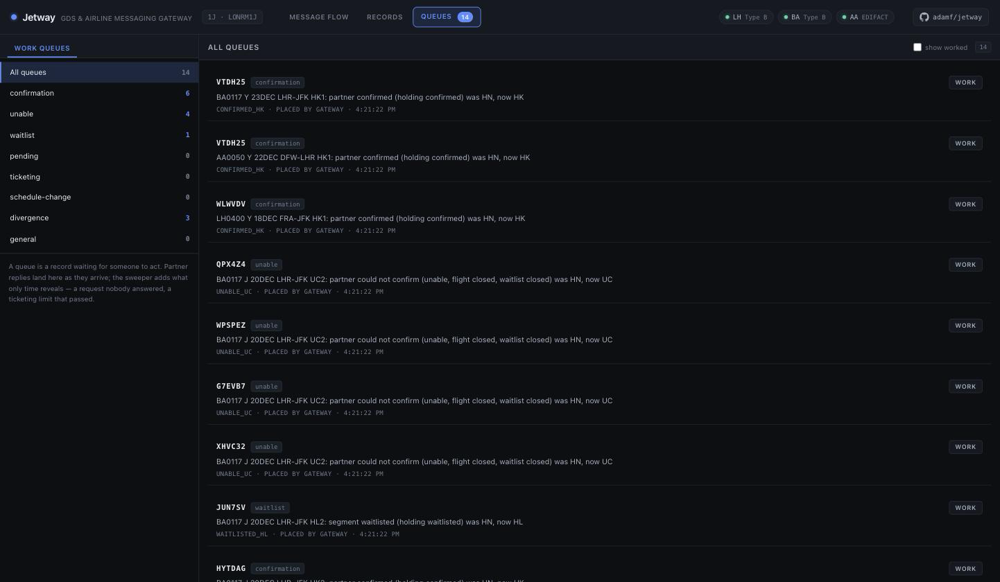
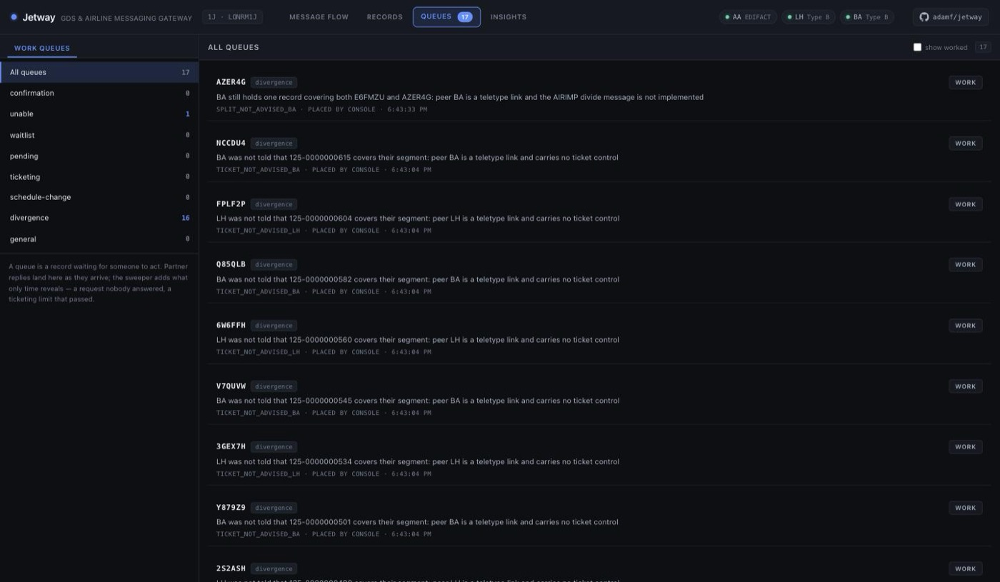
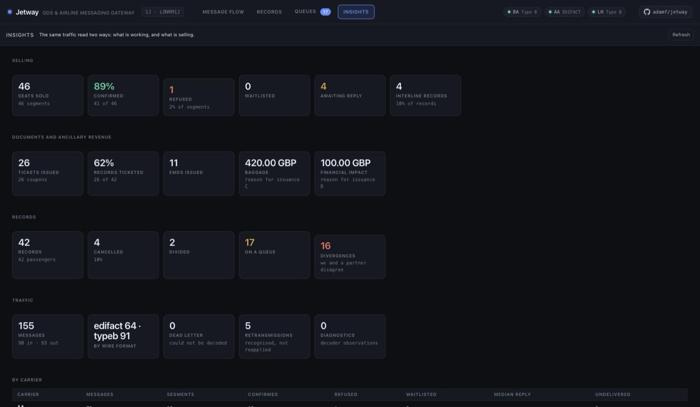
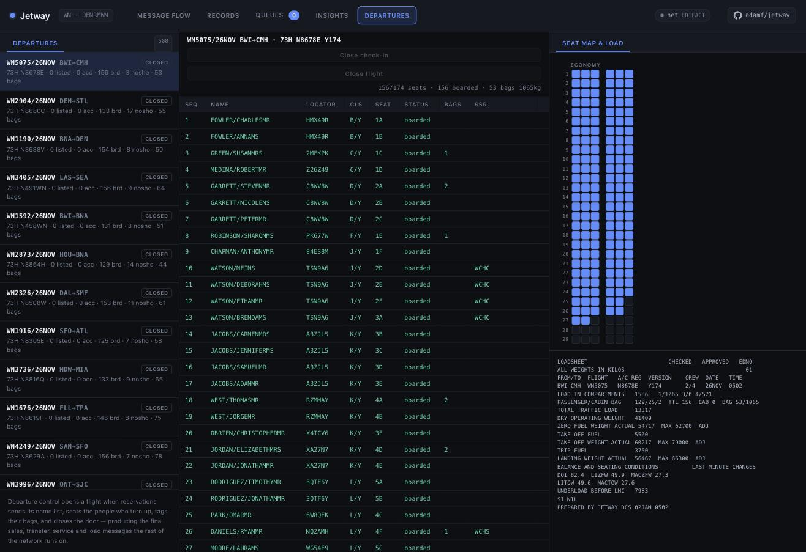
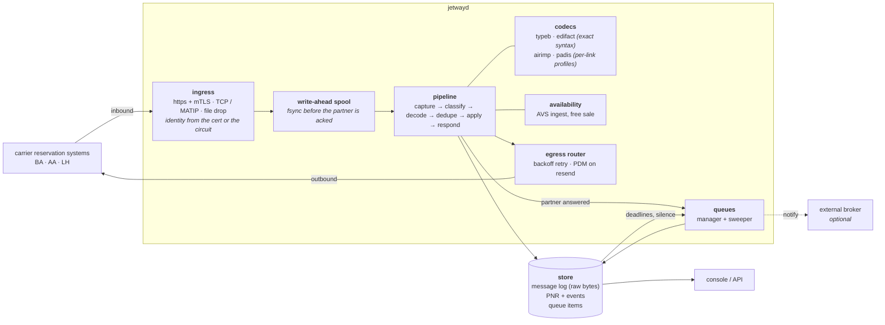

# Jetway

An open-source messaging gateway for airline and GDS reservation traffic.

Jetway terminates carrier links, decodes what arrives on them, keeps passenger
name records, and answers. It speaks the two wire formats interline reservation
traffic actually uses:

- **Type B / AIRIMP** — the teletype format carried by the SITA and ARINC
  store-and-forward networks.
- **UN/EDIFACT / PADIS** — ISO 9735 interchanges carrying IATA messages such as
  `PAOREQ` and `PAORES`, with `CONTRL` sent and consumed.
- **NDC** — IATA order messages over HTTP, mapped onto the same record store.

Point a carrier's stream at it and it will capture, decode, apply and reply —
and when it meets something it does not understand, it keeps that too.

Beyond the messages it holds the record and does things to it: issues tickets
and miscellaneous documents, exchanges coupon status with the carrier flying
the passenger, cancels a booking and tells everyone holding it, divides one
booking into two. Anything that needs a person lands on a work queue, and
anything it could not tell a partner lands there too, named rather than
swallowed.

A partner reaches it over HTTPS with mutual TLS, over a framed TCP circuit, or
by dropping files in a directory. Their identity comes from the certificate
they present or the circuit they arrive on, never from a name they assert.

```
   agent / API                                        carrier reservation systems
        │                                                    │
        ▼                          ingress                   │
  ┌───────────────────────────────────────────┐  https+mTLS  │   ┌──────────┐
  │  jetwayd                                  │◄─────────────┼──►│ BA res   │
  │                                           │              │   └──────────┘
  │  capture ▸ classify ▸ decode ▸ dedupe     │  tcp+mTLS    │   ┌──────────┐
  │          ▸ apply ▸ queue ▸ respond        │◄─────────────┼──►│ AA res   │
  │                                           │              │   └──────────┘
  │  ┌───────┐ ┌────────────┐ ┌─────────────┐ │  file drop   │   ┌──────────┐
  │  │ spool │ │ message log│ │ PNR + events│ │◄─────────────┴──►│ LH res   │
  │  └───────┘ └────────────┘ └─────────────┘ │                  └──────────┘
  │  ┌──────────────────────┐                 │   routed on the address line,
  │  │ work queues + sweeper│                 │   so one message reaches every
  │  └──────────────────────┘                 │   addressee it names
  └───────────────────────────────────────────┘
     fsync before ack           retry with backoff on the way out
```

**[Try the live demo →](https://jetway-demo.fly.dev)** — a real gateway with three
simulated carriers, two wire formats and a seat inventory, running as you read
this. Make a booking and watch it cross the links.



*One booking: the sell goes out, the carrier answers, the record appears — then
the same record seen from the GDS side.*

## Try it

The [hosted demo](https://jetway-demo.fly.dev) needs nothing installed. To run
it yourself:

```sh
go run ./cmd/jetwayd          # console on http://127.0.0.1:8080
```

That starts the gateway, a link server, and three simulated carriers that
connect back over real TCP sockets — two speaking Type B, one speaking EDIFACT,
each with its own record store and its own seat inventory. Open the console,
make a booking, and watch the messages cross the links in both directions, with
the raw wire bytes and the decoded structure side by side.

Things worth trying in the console:

| Try this | What it shows |
| --- | --- |
| Book class **Z** | The carrier refuses: `UC`, and the record goes to cancelled |
| Book the same flight until seats run out | `KK` → `US` (waitlisted) → `UC` |
| Watch the availability panel fill | Carriers broadcast AVS; open classes become free sale |
| Book a class shown **open** | Held immediately at `HK`, reported with `SS` — no round trip |
| Book class **Z** | Broadcast closed, so it is refused before any message is sent |
| Open a received message and press **Replay** | Recognised as a retransmission and refused, not booked twice |
| Compare a Type B message with an EDIFACT one | The same booking on two very different wires |
| Book an **interline** journey from the Records tab | One record, two carriers, two dialects, two locators |
| Open the **Queues** tab after any of the above | Each partner answer becomes a task, one per carrier |
| **Issue tickets** on a record | Document numbers with a mod-7 check digit, a coupon per segment, and the operating carriers told |
| **Cancel** a booking | `XX` goes to every carrier holding it; one that cannot be reached becomes a divergence |
| **Split** a party | Seats divide with the passengers, and every per-passenger reference is remapped |

### Message flow



Every exchange appears twice, once from each side, so you can watch a message
leave the gateway and arrive at the carrier. Selecting one shows the Type B
envelope and the AIRIMP elements broken out: the priority code with the band it
is serviced in, and the action code `NN` explained as *need, sell and report* —
the gateway asking, because this date is outside what the carrier has broadcast
as free sale.

### Records



The GDS side. A record is found by who is travelling, not by its locator, so
the table leads with passengers and the itinerary. Interline records are
marked, and **Their locators** shows the reference each carrier holds for the
same booking — the thing that makes a later message match up. Status is what
the carriers actually said: `HK` held, `HL` waitlisted, `UC` refused and the
record cancelled behind it.

### One record, two carriers, and what was issued against it



Two passengers on two airlines: American DFW–LHR and British Airways LHR–JFK,
one asked over EDIFACT and one over Type B, each answering separately and each
returning its own locator.



Between the itinerary and the documents sits the fare: what the record was
priced at when it was booked, base and taxes in the filing's currency, and
each passenger's fare basis and amount. The tariff is the caller's --
`pkg/fare` is the structure of a filing and carries no fare of its own -- and
the fare basis rides on every segment, which is what a ticket needs.

Below the itinerary is everything issued against it. Two flight tickets, a
coupon per segment. An **EMD-A** for excess baggage, stapled to a named flight
coupon — when that coupon is flown, the value coupon is lifted with it. An
**EMD-S** for a residual balance, attached to no flight at all. And **Split
to**, because a third passenger was divided onto their own record: both halves
stay live, both keep the same carrier locator, and the carriers still hold one
record until they are advised.

### Queues



What a record needs done to it. A partner's answer becomes a task as it
arrives — a confirmation to pass on, a refusal to rebook, a waitlist to watch —
and an interline booking raises one per carrier, because each answers for its
own segment. The reason names the segment, the status it moved from, and the
status it moved to.

Two other things land here that nobody sends a message about: a request a
partner never answered, and a ticketing time limit that passed. Only a periodic
sweep can see those, which is why there is one.

The **divergence** queue is where this node admits it and a partner disagree: a
cancellation that could not be delivered, a ticket the operating carrier was
never told about, a division the carriers still have not been advised of. None
of those are errors the pipeline can retry away, and none of them should be
silent.



Every line names the specific gap rather than reporting a generic failure. A
ticket issued against a segment BA operates cannot be advised, because ticket
control is an EDIFACT message and that link speaks Type B; a division cannot be
advised at all, because the AIRIMP divide message is in a manual that has not
been bought. Both are real states this node is in, and putting them on a queue
is the difference between a known gap and a silent one.

### Insights



The same traffic read two ways, because two different people ask about it. An
operator wants to know what is working: how many messages, on which wire, how
many undecodable, how many retransmissions, and how far this node and its
partners have drifted apart. The business wants to know what is selling: seats,
confirmation rate, refusals, how much of it went out free sale without a
message at all, and what the ancillary documents took in, split by reason for
issuance.

Both come off the same events. Nothing here is a separate reporting pipeline
that can quietly disagree with the message log.

The per-carrier table at the bottom is the one worth watching in production: a
partner whose refusal rate moves, or whose median reply time stretches, is
telling you something before anyone opens a ticket.

From the command line:

```sh
go run ./cmd/jetwayctl status
go run ./cmd/jetwayctl book BA 0175 Y LHR JFK
go run ./cmd/jetwayctl pnr ABC23D
go run ./cmd/jetwayctl messages
```

`jetwayctl decode` works with no server at all, which is what you want when a
partner sends something puzzling:

```sh
go run ./cmd/jetwayctl decode captured.tty
```

### Departures

A node that runs departure control gets a fifth view: the flights under
control, each one's manifest and seat map, and the agent's operations --
accept, board, offload, close check-in, close the flight. Closing produces
the final sales, transfer, service, ticket and load messages and the
loadsheet, right there in the view. The same operations are on
`/api/dcs/...`, which is what a kiosk or a gate reader would call.
`pkg/dcs` is the system behind it; `gateway.Ground` is how a node hands it
what arrives on the wire for the airport and the operations desk: name
lists and their amendments, bag messages, the departure output from other
stations, an aircraft's OOOI reports forwarded by its datalink provider,
and air traffic services' messages in their AFTN envelopes.



## Connecting a partner

Ingress is configuration, not code. Each listener declares how bytes are framed
and how the sender is identified:

```yaml
ingress:
  - name: partners-https
    type: https
    addr: 0.0.0.0:8443
    tls:
      cert: /etc/jetway/tls/server.crt
      key: /etc/jetway/tls/server.key
      client_ca: /etc/jetway/tls/partners-ca.crt   # requires a client certificate
    identify:
      by_cert_cn:
        gateway.ba.example.com: BA
    synchronous: true          # return the reply in the response body

  - name: link-lh
    type: tcp
    addr: 0.0.0.0:9103
    framing: {kind: length_prefix, header_bytes: 2, inclusive: true}
    tls: {cert: ..., key: ..., client_ca: ...}
    identify:
      by_cert_cn: {res.lh.example.com: LH}

  - name: ba-batch
    type: filedrop
    dir: /var/spool/jetway/in/ba
    stable_for: 5s             # do not read a file still being uploaded
    identify: {peer: BA}
```

A certificate signed by the right CA but not mapped to a peer is **refused**,
not fallen back to a default. That is the case that matters: the TLS handshake
succeeds, so only the mapping stands between a stranger and writing to somebody
else's records.

Replies go out over each peer's configured egress — back down the inbound
session, dialled out, posted, or dropped in a directory — and are retried with
backoff. A restart recovers the backlog from the message log rather than
trusting an in-memory queue to have survived.

Worked examples: [deploy/jetway.example.yaml](deploy/jetway.example.yaml) for a
real deployment, [deploy/jetway.compose.yaml](deploy/jetway.compose.yaml) for
the container stack. Full walkthrough in
[docs/adding-a-carrier.md](docs/adding-a-carrier.md).

## Design

Six decisions shape everything else.

**Raw bytes are made durable before anything interprets them.** Capture is the
first stage of the pipeline and it is unconditional. Every later stage is a
function of those bytes plus configuration, so a parser fix can be applied to
traffic that already failed — `POST /api/message/{id}/replay` — instead of
asking a partner to retransmit something they consider delivered. It also means
"what did we actually receive at 14:32" has an answer that does not depend on
which parser was deployed at the time.

**Nothing that cannot be understood is discarded.** An unrecognised AIRIMP line
or an unmapped EDIFACT segment becomes an unparsed fragment attached to the
record. A dialect gap then shows up as visible data on a live booking rather
than as silence. A message that cannot be decoded at all goes to a dead letter
queue with its bytes intact; it never leaves the system.

**PNR state is derived and versioned.** `pnr.state` is a projection for cheap
reads; `pnr_event` holds every change with the id of the message that caused
it. A gateway and a carrier can be modifying one record at the same instant, so
writes carry the version they read and a stale write is refused rather than
allowed to overwrite what it never saw.

**Availability is a claim about a moment, not a fact.** Every belief carries its
age and where it came from, and a lookup returns both. A status older than the
trust window stops being evidence and the booking falls back to asking. Code
that cannot tell a fresh claim from a day-old one sells seats that went hours
ago.

**Acknowledging a partner does not depend on the database.** Ingest fsyncs the
raw bytes to a local spool and acknowledges; a drainer moves them into the store
afterwards and retries for as long as it takes. Without that, a Postgres
failover becomes refused acknowledgements and a bet on every partner's
retransmission behaviour. With it, `/readyz` goes 503 so a load balancer backs
off while partners still get a clean 202.

**Wire syntax is exact; message grammar is a profile.** ISO 9735 and the Type B
envelope are stable and universal, so those layers are strict about what they
validate. Message composition varies by carrier, version and bilateral
agreement, so the layers above are ordered recognizers and segment handlers you
replace per link — `airimp.Profile`, `padis.Profile` — without forking
anything. An unknown message type still decodes at the syntax layer, so it can
be captured, routed and replayed even when nothing above knows what it means.
See [Provenance](#provenance-and-what-this-is-not).

## Architecture

Sequence diagrams for every message flow and state diagrams for every
status vocabulary live in [docs/](docs/README.md) — who talks to whom, in
what order, and what a status is allowed to become.



Three things in that picture are load-bearing.

**Capture precedes interpretation.** Raw bytes are durable before anything
parses them, which is why a parser fix costs a reprocessing run rather than a
lost booking, and why "what did we actually receive at 14:32" has an answer that
does not depend on the parser deployed at the time.

**Queue state is in the store, not in a broker.** A reservations queue is a
worklist, not a transport: it has to be listed, counted, filtered, and re-read,
and items survive being worked because *who cleared this, and when* is the
question asked after an interline dispute. Those are database semantics. What an
external queueing system is genuinely good at is the other half — telling a
robot that work has arrived — and that is the dotted line: a placement is
written first and published second, so a broker being down delays a
notification instead of losing a task. `queue.Publisher` is the seam;
`store.QueueStore` is the state.

**The sweeper is not optional.** A partner who answers puts work on a queue by
answering. A partner who never answers puts work on no queue at all, and neither
does a ticketing deadline passing, because neither is an event anyone sends.

## The biggest gap is a document, not code

Several message layers here are defined in paid IATA publications that were not
bought. They are implemented as extensible profiles built from what is public
and inferred from message shapes: they work, they are not conformant, and no
amount of testing closes that difference, because the tests would be checking
the same guess twice.

The most expensive single absence is the **AIRIMP divide message**. A booking
can be split correctly, and the carriers cannot be told, so both halves keep the
same carrier locator and every division is recorded as a divergence. It is the
last of the "we changed something and could not tell them" cases — building the
cancellation message closed three blocked features at once, and this one is
shaped identically.

[docs/roadmap.md](docs/roadmap.md#blocked-on-documents-we-do-not-have) lists
each document and exactly what it costs. If you have any of them and can say
where this is wrong, that is the single most useful contribution available.

## Packages

| Package | What it is |
| --- | --- |
| `pkg/typeb` | Type B teletype envelope: priority and address lines, origin line, character repertoires |
| `pkg/edifact` | UN/EDIFACT ISO 9735 syntax: UNA service characters, release characters, repetitions, envelope validation |
| `pkg/airimp` | AIRIMP message grammar over Type B text, as an extensible recognizer profile |
| `pkg/padis` | IATA PADIS message mapping over EDIFACT, as an extensible segment-handler profile; the PNRGOV push to a state, built and read against the public implementation guide |
| `pkg/rescode` | The reservation action and status vocabulary both wire formats share |
| `pkg/avail` | What is sellable: statuses, seat counts, provenance and age |
| `pkg/avs` | Availability Status messages, as a per-link profile |
| `pkg/pnr` | The canonical passenger name record, date resolution and record locator allocation |
| `pkg/store` | Append-only message log and event-sourced PNR store; in-memory and Postgres |
| `pkg/gateway` | The pipeline, routing, response generation and seat inventory |
| `pkg/queue` | Work queues: placement, the time-based sweeper, and the external-publisher seam |
| `pkg/ssim` | SSM and ASM schedule messages, as an extensible profile; the chapter 7 schedule file read and written |
| `pkg/ndc` | NDC order messages over HTTP: create, retrieve, cancel, and the order view |
| `pkg/matip` | MATIP (RFC 2351): packet format and the Type B session handshake |
| `pkg/mvt` | MVT/MVA/DIV aircraft movement messages: departures, arrivals, delays, diversions |
| `pkg/pnl` | PNL and ADL passenger name lists: what reservations tells the airport |
| `pkg/atfm` | Air traffic flow management slot messages in ADEXP: the SAM that gives a flight its calculated take-off time, SRM, SLC, FLS, DES and the operator's replies, with the regulation cause and its IATA delay code, to EUROCONTROL's public ATFCM Users Manual |
| `pkg/crew` | Flight crew legality: flight time and flight duty period limits by report time and segments, the two-hour extension and the ten-hour rest, from 14 CFR Part 117 as published; a duty checked as planned and again as the day runs late |
| `pkg/baggage` | BSM, BPM and BUM bag messages: tags issued, bags loaded, a bag rushed without its passenger; AHL, OHD and FWD tracing files for a bag that did not arrive, one found without its passenger, and the match that forwards it |
| `pkg/fare` | Fares filed per market and class with rules and taxes, and the pricing that sells each segment under the cheapest fare whose rules the trip meets |
| `pkg/inventory` | A carrier's seat inventory: capacity per cabin from the schedule, sold and waitlisted per flight, rebuilt from the book of record; answers sells and broadcasts availability; an EMSR-b revenue management controller sets the nested authorisations from a demand forecast; bid-price control over connecting itineraries, from the leg ladders or from the network linear programme whose duals price each leg |
| `pkg/bsp` | Settlement: the BSP HOT file an airline receives for its agents' sales and the RET a reporting system sends the plan, with agency debit and credit memos against the documents they correct, to IATA's public DISH 23 handbook, written and read |
| `pkg/prorate` | Interline proration: a through fare divided between coupons by mileage, with the interline service charge, for billing between the carrier that flew and the carrier that sold |
| `pkg/dcs` | Departure control: the manifest, check-in, seating, bag tagging, boarding, close; bag reconciliation at the door; through check-in for another carrier's connecting passengers; an aircraft substitution that re-seats the cabin; PFS, PTM, PSM, ETL, LDM, CPM; load control and the loadsheet |
| `pkg/aftn` | The Aeronautical Fixed Telecommunication Network envelope (ICAO Annex 10 Vol II): priority, eight-letter addressee indicators, origin, ZCZC/NNNN |
| `pkg/ats` | ICAO air traffic services messages (Doc 4444 Appendix 3): FPL, DEP, ARR, DLA, CNL, CHG |
| `pkg/acars` | ARINC 620 OOOI reports -- out, off, on, in -- as a datalink provider forwards them to the airline |
| `pkg/paxlst` | Advance passenger information: the UN/EDIFACT PAXLST list a border agency receives before departure, to the public WCO/IATA/ICAO guide |
| `pkg/iatci` | Inter-airline through check-in: the DCQCKI/DCRCKA dialogue by which one carrier's DCS checks a connecting passenger in on another's flight |
| `pkg/irops` | Irregular operations: the engine that works the schedule-change queue, rebooking a cancelled flight's passengers onto the next seat over the same city pair |
| `pkg/ingress` | MATIP, HTTPS, TCP and file-drop listeners, and peer identity |
| `pkg/egress` | Outbound delivery with backoff and restart recovery; `link_dial` holds a bidirectional framed link open to another node, which is how one switch trunks to another |
| `pkg/spool` | Durable write-ahead buffer for inbound messages |
| `pkg/config` | Deployment configuration |
| `pkg/metrics` | Prometheus exposition, no client library |
| `pkg/telemetry` | OpenTelemetry tracing, with a hand-rolled OTLP/JSON exporter |
| `pkg/transport` | Framing and link sessions |
| `pkg/node` | The assembly: one wiring, built by both `jetwayd` and the scenario suite |
| `internal/scenario` | End-to-end scenarios and the load driver that reuses them |

The whole `pkg/...` tree is importable, in two layers. The codec packages
(`typeb`, `edifact`, `airimp`, `padis`, `avs`, `ssim`, `ndc`, `matip`, `pnr`,
`rescode`, `avail`, `pnl`, `baggage`, `mvt`, `dcs`, `aftn`, `ats`, `acars`, `iatci`, `paxlst`) depend on nothing above them and on each other only through
the canonical model — import one to parse a format and take nothing else. The
application packages (`gateway`, `store`, `node`, `queue`, `ingress`, `egress`,
`transport`, `config`, `demo`) are the running system, importable as a library:
`pkg/node` builds the same assembly `jetwayd` runs, which is how something like
a fleet simulator hosts many gateways in one process.

## Two details that bite in production

**Airline messages carry no year.** A segment says `15JUN`. Resolving that
against the wrong year silently misfiles a booking and breaks every subsequent
match against it. `pnr.ResolveDate` resolves against the time the message was
*received*, not the current time, so replaying an old message reproduces the
original reading, and it refuses `29FEB` in a non-leap year rather than
quietly shifting the departure to 1 March.

**Record locators must be unique, unguessable and cheap.** Allocating them
sequentially leaks booking volume and invites enumeration. Allocating them
randomly needs a uniqueness check and a retry loop that contends exactly when
traffic is heaviest. `pnr.LocatorAllocator` runs a keyed Feistel network over
the 32⁶ code space: a bijection, so distinct counter values always produce
distinct locators with no lookup and no retry, while the output order reveals
nothing about the input order. The alphabet omits `I`, `O`, `0` and `1`,
because locators get read aloud.

## Testing it, and loading it

The end-to-end scenarios are written once and run two ways.

```sh
go test ./internal/scenario          # run each once, assert it behaved
go run ./cmd/jetwayload -list        # what the scenarios are
go run ./cmd/jetwayload -workers 16 -for 30s
go run ./cmd/jetwayload -workers 32 -for 2m -dsn "$JETWAY_DSN"
```

Both drive the **same node assembly `jetwayd` builds**, from `pkg/node`,
with the simulated carriers dialling real TCP into real listeners on ephemeral
ports. Nothing about the transport is stubbed, and there is no second copy of
the wiring for tests to pass against.

Sharing the scenarios between the two is the point. A load generator with its
own private code path measures how fast something nobody has checked can run,
and an integration suite that never runs under concurrency misses every race.

On a laptop, sixteen workers for twenty seconds:

| Store | Runs | Failed | Throughput |
| --- | --- | --- | --- |
| in-memory | 52,044 | 0 | 2,601/sec |
| postgres | 55,475 | 0 | 2,670/sec |

Postgres being *faster* than the in-memory store was not the expected result.
The memory store serialises on one mutex; Postgres gets row-level concurrency.
Worth knowing before treating the `mem` backend as the fast path — it is for
demos and tests, not for load.

Writing the suite found four real defects, which is the argument for having it.
The one worth repeating: a booking whose agent name contained a lowercase
letter could not be requested from an EDIFACT carrier **at all**, because UNOA
has no lowercase and the whole message failed to encode. Nothing in the unit
tests used a lowercase agent name.

## The hosted demo

[jetway-demo.fly.dev](https://jetway-demo.fly.dev) runs the same binary this
repository builds, from the same Dockerfile — the carrier links are real TCP
sessions, bound to loopback inside the container because the carriers live in
the same process. Nothing is mocked.

It is a demo, so: storage is in memory and bounded, everything is forgotten on
restart, the console is unauthenticated and anyone can make a booking, and the
machine suspends when nobody is looking at it — so the first request after a
quiet spell takes a moment. Deployment config is in
[fly.toml](fly.toml) and [deploy/jetway.demo.yaml](deploy/jetway.demo.yaml).

## Running it for real

```sh
docker compose up --build          # gateway + Postgres + the simulated fleet
```

or directly:

```sh
createdb jetway
export JETWAY_DSN="postgres://user@host/jetway?sslmode=disable"
export JETWAY_LOCATOR_SECRET=$(openssl rand -hex 32)
jetwayd -config /etc/jetway/jetway.yaml
```

`jetwayd -print-config` shows the effective configuration without starting
anything. The schema is embedded and applied on start; `jetwayctl schema` prints
it if a DBA would rather review it first.

`JETWAY_LOCATOR_SECRET` must be stable. It keys record locator allocation, and
changing it remaps the code space, so a locator already issued will eventually
be issued again to a different booking. `jetwayd` generates an ephemeral one and
warns; treat that warning as a blocker.

| Endpoint | Purpose |
| --- | --- |
| `/healthz` | Liveness. Never touches a dependency — restarting because the database blipped makes the outage worse. |
| `/readyz` | Readiness. 503 when the store is unusable, while standing by for a system's lease, or when the spool's oldest entry is older than 30 s, so a load balancer backs off. |
| `/metrics` | Prometheus. Watch `jetway_spool_depth`, `jetway_outbox_congested_total`, `jetway_egress_retry_queue`, and `jetway_ingress_rejected_total`. |
| `POST /api/admin/retire` | Retention: drops the daily partitions before a cutoff. `jetwayctl retire --before 2025-11-27` from a scheduled job. |
| `GET /api/admin/export` | The archive: every record the node holds as newline-delimited JSON, oldest first. `jetwayctl export --out records.ndjson` weekly, before retention drops the day; a regulator asks years later. |

The full production plan -- topology, the lease, database sizing, disaster
recovery, the alerts and load testing -- is [docs/production-gcp.md](docs/production-gcp.md).

To run a simulated carrier as its own process:

```sh
go run ./cmd/carriersim -carrier BA -format typeb -tty LHRRMBA -link 127.0.0.1:9101
```

## Adding a carrier

Most links need three things: an ingress entry saying how they are framed and
identified, a peer entry saying how to reach them, and — when their dialect
differs from the shipped profile — a recognizer or segment handler. The first
two are configuration. See [docs/adding-a-carrier.md](docs/adding-a-carrier.md).

## Built on it

[wholesky](https://github.com/adamf/wholesky) simulates global passenger
aviation on this library — live at https://wholesky-demo.fly.dev : a Jetway node in relay mode as the message switch,
carrier reservation systems as multi-tenant hosts, and a GDS reaching every
carrier through one switch link -- AIRIMP over Type B and PADIS over EDIFACT,
relayed by address line and UNB recipient. It is also why the application
packages live under `pkg/` and why MVT and the `via` egress exist.

## Independence

Jetway is an independent implementation. It is **not affiliated with, authorised
by, or endorsed by IATA, A4A, SITA or ARINC**, and no part of any IATA
publication is reproduced here. Message formats are implemented as functional
protocols; where a specification is the normative source, the code cites the
section rather than quoting it.

## Provenance, and what this is not

The two sides differ, and it matters:

- **EDIFACT is largely open.** UN/EDIFACT syntax (ISO 9735) is free from UNECE,
  and IATA publishes the [PNRGOV EDIFACT Implementation
  Guide](https://www.iata.org/contentassets/18a5fdb2dc144d619a8c10dc1472ae80/pnrgov20edifact20implementation20guide2015_1.pdf)
  openly, documenting the PADIS segment composition. `pkg/edifact` and
  `pkg/padis` are checked against those.
- **AIRIMP is not.** It is a paid IATA publication (product IATA9098, 50th
  edition) sold on quote, and it is the normative source for teletype message
  composition. `pkg/airimp` implements the elements that are stable and widely
  documented, and treats everything else as opaque.

Either way the code is organised on the assumption that you will adjust it per
link, because carrier dialects diverge from both.

Jetway is a messaging gateway and a record store. It is deliberately **not**:

- an availability or inventory system — `gateway.Responder` is the seam where
  yours plugs in, and the bundled `Inventory` is a simulator for testing;
- a fares, pricing or ticketing engine;
- a departure control system;
- an NDC or ONE Order implementation, though nothing here precludes one.

MATIP is implemented from RFC 2351 itself, which is an open IETF document, so
`pkg/matip` follows the standard rather than approximating it: the four-byte
header, the session open, open confirm and session close handshake, and Type B
data packets. Carriers do run non-conforming variants, so still check the
partner's interface control document before a link goes live.

## Security and personal data

PNRs hold passport, address and contact details. `SSR` codes `DOCS`, `DOCA`,
`DOCO` and `FOID` are flagged `Sensitive`, `PNR.Redacted()` strips them for
logs and for parties not entitled to see them, and the console redacts them.
Field-level encryption at rest and retention policy are **not yet implemented** —
see [docs/roadmap.md](docs/roadmap.md). Do not put real passenger data in a
deployment until they are.

The link handshake identifies a peer by a name it asserts. It is not
authentication, and it is not a substitute for binding identity to the
transport's own credentials. See [SECURITY.md](SECURITY.md).

## Contributing

Tests are the interesting part of this codebase: the store conformance suite
runs the same assertions against both backends, the EDIFACT codec is fuzzed for
round-trip stability — a property that has already caught six real defects —
and the ingress tests mint a throwaway certificate authority to prove that an
unmapped certificate is refused rather than accepted as a default peer. See [CONTRIBUTING.md](CONTRIBUTING.md).

```sh
make check       # format, vet, test
make test-pg     # include the Postgres store conformance tests
make fuzz        # fuzz the EDIFACT codec
```

## Documentation

- [docs/architecture.md](docs/architecture.md) — the pipeline, stage by stage
- [docs/protocols.md](docs/protocols.md) — what is implemented of each wire format
- [docs/adding-a-carrier.md](docs/adding-a-carrier.md) — onboarding a link
- [docs/operations.md](docs/operations.md) — running it, and what to do when a message fails
- [docs/scaling.md](docs/scaling.md) — measured throughput, what breaks first, and why MATIP resists load balancing
- [docs/production-gcp.md](docs/production-gcp.md) — running it for real on Google Cloud: topology, one writer per system, capacity, failover, DR, observability, and what the code still needs first
- [docs/roadmap.md](docs/roadmap.md) — what is missing

## Licence

MIT. See [LICENSE](LICENSE).
