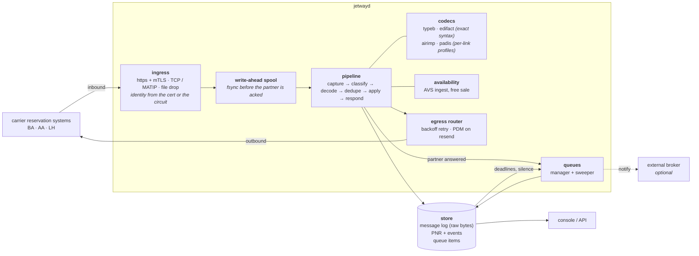

# Jetway

Jetway is an open-source messaging gateway for airline and global distribution
system (GDS) reservation traffic.

Jetway terminates carrier links, decodes what arrives on them, keeps passenger
name records (PNRs), and replies. It speaks the wire formats that interline
reservation traffic uses:

- **Type B / AIRIMP** is the teletype format that the SITA and ARINC
  store-and-forward networks carry.
- **UN/EDIFACT / PADIS** consists of ISO 9735 interchanges that carry IATA
  messages such as `PAOREQ` and `PAORES`. Jetway sends and consumes `CONTRL`.
- **NDC** consists of IATA order messages over HTTP. Jetway maps them onto the
  same record store.

Point a carrier's stream at Jetway. It captures, decodes, applies and replies.
When it receives a message that it cannot decode, it keeps that message.

Jetway also holds the record and acts on it. It issues tickets and
miscellaneous documents, and it exchanges coupon status with the carrier that
flies the passenger. It cancels a booking and notifies every carrier that holds
the booking, and it divides 1 booking into 2. Any event that needs a person goes
to a work queue. Any change that Jetway could not advise to a partner goes to
the same queue. The queue item names the failure.

A partner reaches Jetway over HTTPS with mutual TLS, over a framed TCP circuit,
or by dropping files in a directory. The partner's identity comes from the
certificate that it presents or the circuit on which it arrives. It never comes
from a name that the partner asserts.

```
   agent / API                                        carrier reservation systems
        │                                                    │
        ▼                          ingress                   │
  ┌───────────────────────────────────────────┐  https+mTLS  │   ┌──────────┐
  │  jetwayd                                  │◄─────────────┼──►│ BA res   │
  │                                           │              │   └──────────┘
  │  capture ▸ classify ▸ decode ▸ dedupe     │  tcp+mTLS    │   ┌──────────┐
  │          ▸ apply ▸ queue ▸ respond        │◄─────────────┼──►│ AA res   │
  │                                           │              │   └──────────┘
  │  ┌───────┐ ┌────────────┐ ┌─────────────┐ │  file drop   │   ┌──────────┐
  │  │ spool │ │ message log│ │ PNR + events│ │◄─────────────┴──►│ LH res   │
  │  └───────┘ └────────────┘ └─────────────┘ │                  └──────────┘
  │  ┌──────────────────────┐                 │   routed on the address line,
  │  │ work queues + sweeper│                 │   so one message reaches every
  │  └──────────────────────┘                 │   addressee it names
  └───────────────────────────────────────────┘
     fsync before ack           retry with backoff on the way out
```

**[Try the live demo →](https://jetway-demo.fly.dev)**. The demo is a live
gateway with 3 simulated carriers, 2 wire formats and a seat inventory. Make a
booking and watch it cross the links.


*The sell for 1 booking goes out, the carrier replies, and the record appears.
The same record is then shown from the GDS side.*

## Quick start

The [hosted demo](https://jetway-demo.fly.dev) needs no installation. To run
Jetway yourself:

```sh
go run ./cmd/jetwayd          # console on http://127.0.0.1:8080
```

That command starts the gateway, a link server, and 3 simulated carriers. The
carriers connect back over TCP sockets. Of the 3 carriers, 2 speak Type B and 1
speaks EDIFACT. Each carrier has its own record store and its own seat
inventory. Open the console and make a booking. Watch the messages cross the
links in both directions, with the raw wire bytes beside the decoded structure.

Actions to try in the console:

| Try this | What it shows |
| --- | --- |
| Book class **Z** | The carrier refuses: `UC`, and the record goes to cancelled |
| Book the same flight until seats run out | `KK` → `US` (waitlisted) → `UC` |
| Watch the availability panel fill | Carriers broadcast AVS; open classes become free sale |
| Book a class shown **open** | Held immediately at `HK` and reported with `SS`. No round trip. |
| Book class **Z** | Broadcast closed, so it is refused before any message is sent |
| Open a received message and press **Replay** | Recognised as a retransmission and refused, not booked twice |
| Compare a Type B message with an EDIFACT one | The same booking on two very different wires |
| Book an **interline** journey from the Records tab | One record, two carriers, two dialects, two locators |
| Open the **Queues** tab after any of the above | Each partner answer becomes a task, one per carrier |
| **Issue tickets** on a record | Document numbers with a mod-7 check digit, a coupon per segment, and the operating carriers told |
| **Cancel** a booking | `XX` goes to every carrier holding it; one that cannot be reached becomes a divergence |
| **Split** a party | Seats divide with the passengers, and every per-passenger reference is remapped |

### Message flow


Every exchange appears twice, once from each side. You can watch a message
leave the gateway and arrive at the carrier. When you select a message, the view
shows the Type B envelope and the AIRIMP elements as separate fields. It shows
the priority code with its service band. It explains the action code `NN` as
*need, sell and report*. The gateway sends `NN` because this date is outside the
free sale that the carrier has broadcast.

### Records


This view is the GDS side. Agents find a record by the passengers who travel,
rather than by its locator. The table therefore leads with passengers and the
itinerary. Interline records are marked, and **Their locators** shows the
reference that each carrier holds for the same booking. That reference is what
matches a later message to the record. The status is what the carriers said:
`HK` held, `HL` waitlisted, or `UC` refused with the record cancelled behind it.

### Record detail


The record has 2 passengers on 2 airlines: American DFW–LHR and British Airways
LHR–JFK. Jetway asked 1 carrier over EDIFACT and 1 over Type B. Each carrier
replied separately, and each returned its own locator.


The fare sits between the itinerary and the documents. It shows the price of
the record at the time of booking. It gives base and taxes in the filing's
currency, and each passenger's fare basis and amount. The caller supplies the
tariff. `pkg/fare` is the structure of a filing and carries no fare of its own.
The fare basis is on every segment, because a ticket needs it there.

Below the itinerary is everything issued against it. There are 2 flight
tickets, with a coupon per segment. An **EMD-A** for excess baggage is
associated with a named flight coupon, and when that coupon is flown the value
coupon is lifted with it. An **EMD-S** for a residual balance is attached to no
flight. **Split to** shows that a third passenger was divided onto a separate
record. Both halves stay live, both keep the same carrier locator, and the
carriers hold 1 record until they are advised of the division.

### Queues


The queues hold the work that a record needs. A partner's reply becomes a task
when it arrives. The task can be a confirmation to pass on, a refusal to rebook,
or a waitlist to watch. An interline booking raises 1 task per carrier, because
each carrier replies for its own segment. The reason names the segment, the
previous status and the new status.

Other events also reach the queues, and nobody sends a message about them.
These are a request that a partner never answered, and a ticketing time limit
that passed. Only a periodic sweep can detect those events. That is the reason
for the sweeper.

The **divergence** queue records each case in which this node and a partner
disagree. Examples are a cancellation that could not be delivered, and a ticket
that the operating carrier was never told about. Another example is a division
that the carriers have not been advised of. The pipeline cannot repair those
cases by a retry, and none of them should be silent.


Every line names the specific gap instead of a generic failure. Jetway cannot
advise a ticket issued against a segment that BA operates. Ticket control is an
EDIFACT message, and that link speaks Type B. Jetway cannot advise a division at
all, because the AIRIMP divide message is in a manual that the project has not
bought. Both are states that this node is in. A queue item makes each gap known
instead of silent.

### Insights


This view reads the same traffic in 2 ways, because 2 kinds of people ask about
it. An operator wants to know what is working. The view gives the number of
messages on each wire, the number undecodable, and the number of
retransmissions. It also shows how far this node and its partners have drifted
apart.

The business wants to know what is selling. The view gives seats, confirmation
rate and refusals, and the share that went out as free sale without any message.
It gives the amount that ancillary documents collected, split by reason for
issuance.

Both views come from the same events. There is no separate reporting pipeline
that can disagree with the message log.

In production, watch the per-carrier table at the bottom. A change in a
partner's refusal rate, or a rise in its median reply time, indicates a problem
before anyone reports one.

From the command line:

```sh
go run ./cmd/jetwayctl status
go run ./cmd/jetwayctl book BA 0175 Y LHR JFK
go run ./cmd/jetwayctl pnr ABC23D
go run ./cmd/jetwayctl messages
```

`jetwayctl decode` works with no server. Use it when a partner sends a message
that you do not understand:

```sh
go run ./cmd/jetwayctl decode captured.tty
```

### Departures

A node that runs departure control has a fifth view. It shows the flights under
control, with the manifest and seat map of each flight. It offers the agent's
operations: accept, board, offload, close check-in, and close the flight.
Closing a flight produces the final sales, transfer, service, ticket and load
messages and the loadsheet, in the same view. The same operations are on
`/api/dcs/...`, which is the interface for a kiosk or a gate reader.

`pkg/dcs` is the system behind the view. Through `gateway.Ground`, a node passes
`pkg/dcs` the messages that arrive on the wire for the airport and the
operations desk. Those messages are name lists and their amendments, bag
messages, and the departure output from other stations. They also include an
aircraft's OOOI reports forwarded by its datalink provider, and air traffic
services' messages in their AFTN envelopes.


## Connecting a partner

Ingress is configuration. You write no code for it. Each listener declares how
bytes are framed and how the sender is identified:

```yaml
ingress:
  - name: partners-https
    type: https
    addr: 0.0.0.0:8443
    tls:
      cert: /etc/jetway/tls/server.crt
      key: /etc/jetway/tls/server.key
      client_ca: /etc/jetway/tls/partners-ca.crt   # requires a client certificate
    identify:
      by_cert_cn:
        gateway.ba.example.com: BA
    synchronous: true          # return the reply in the response body

  - name: link-lh
    type: tcp
    addr: 0.0.0.0:9103
    framing: {kind: length_prefix, header_bytes: 2, inclusive: true}
    tls: {cert: ..., key: ..., client_ca: ...}
    identify:
      by_cert_cn: {res.lh.example.com: LH}

  - name: ba-batch
    type: filedrop
    dir: /var/spool/jetway/in/ba
    stable_for: 5s             # do not read a file still being uploaded
    identify: {peer: BA}
```

Jetway **refuses** a certificate that the right CA signed but that is not mapped
to a peer. It does not fall back to a default peer. That case matters. The TLS
handshake succeeds, and only the mapping prevents an unknown client from writing
to another peer's records.

Replies go out over each peer's configured egress. The egress can be the inbound
session, a dialled connection, an HTTP post, or a file dropped in a directory.
Jetway retries replies with backoff. After a restart, Jetway recovers the
backlog from the message log. It does not depend on an in-memory queue that
survived the restart.

[deploy/jetway.example.yaml](deploy/jetway.example.yaml) is a worked example
for a production deployment. [deploy/jetway.compose.yaml](deploy/jetway.compose.yaml)
is a worked example for the container stack.
[docs/adding-a-carrier.md](docs/adding-a-carrier.md) is the full walkthrough.

A listener with `identify.by_hello` identifies a subscriber by its hello. It
accepts the name that the peer asserts. That is acceptable on a private network
but not on the internet. When you give the peer a `token` in its entry, the
hello must carry that token. The node that dials in with `link_dial` sends its
configured token. The switch refuses a link that names the peer without the
token, and counts the refusal in
`jetway_ingress_rejected_total{reason="bad_token"}`.

The token is a shared secret. It is not a certificate. Use TLS with client
certificates where the links can carry them.

On a listener that the internet can reach, set `require_token: true`,
`idle_timeout` and `max_connections`. With `require_token: true`, the listener
refuses a peer with no token. Without it, an unknown client could hello as any
tokenless peer and displace its session. With `idle_timeout`, the listener
closes a link that has sent nothing. `max_connections` is 4,096 unless set. When
the limit is reached, the listener refuses new connections and the process
continues.

## Design

The rest of the design follows from 6 decisions.

**Jetway makes raw bytes durable before any stage interprets them.** Capture is
the first stage of the pipeline, and it is unconditional. Every later stage is a
function of those bytes plus configuration. You can therefore apply a parser fix
to traffic that already failed, with `POST /api/message/{id}/replay`. The
partner does not have to retransmit a message that it considers delivered. The
question "what did we receive at 14:32" has an answer that does not depend on
the parser deployed at the time.

**Jetway discards nothing that it cannot decode.** An unrecognised AIRIMP line
or an unmapped EDIFACT segment becomes an unparsed fragment attached to the
record. A dialect gap then shows as visible data on a live booking instead of as
silence. A message that cannot be decoded at all goes to a dead letter queue
with its bytes intact. It never leaves the system.

**PNR state is derived and versioned.** `pnr.state` is a projection for cheap
reads. `pnr_event` holds every change with the id of the message that caused
it. A gateway and a carrier can modify 1 record at the same instant. Each write
therefore carries the version that it read. Jetway refuses a stale write instead
of letting it overwrite state that it never saw.

**Availability is a claim about a moment in time. It is not a fact.** Every
availability status carries its age and its source, and a lookup returns both. A
status older than the trust window is no longer evidence, and the booking then
falls back to a request to the carrier. Code that cannot distinguish a fresh
claim from a day-old claim sells seats that were sold hours earlier.

**Acknowledgement of a partner does not depend on the database.** Ingest fsyncs
the raw bytes to a local spool and then acknowledges. A drainer moves the bytes
into the store afterwards and retries until the store accepts them. Without the
spool, a Postgres failover would cause refused acknowledgements, and delivery
would depend on every partner's retransmission behaviour. With the spool,
`/readyz` returns 503 and the load balancer backs off. Partners still receive a
clean 202.

**Wire syntax is exact, and message grammar is a profile.** ISO 9735 and the
Type B envelope are stable and universal, and those layers therefore validate
strictly. Message composition varies by carrier, version and bilateral
agreement. The layers above the syntax are therefore ordered recognizers and
segment handlers that you replace per link, in `airimp.Profile` and
`padis.Profile`, without a fork.

An unknown message type still decodes at the syntax layer. Jetway can therefore
capture, route and replay it even when no higher layer recognises it. See
[Provenance](#provenance-and-scope).

## Architecture

[docs/](docs/README.md) holds sequence diagrams for every message flow and
state diagrams for every status vocabulary. The sequence diagrams show which
system sends each message, and in what order. The state diagrams show the
permitted transitions of each status.



The design depends on 3 properties in that diagram.

**Capture precedes interpretation.** Raw bytes are durable before any stage
parses them. A parser fix therefore costs a reprocessing run instead of a lost
booking. The question "what did we receive at 14:32" has an answer that does not
depend on the parser deployed at the time.

**The store holds queue state. A broker does not.** A reservations queue is a
worklist that users list, count, filter and re-read. It is not a transport.
Items survive being worked, because an interline dispute later asks who cleared
an item and when. Those are database semantics.

An external queueing system is good at notification. It tells an automated
worker that work has arrived. That is the dotted line in the diagram. Jetway
writes a placement first and publishes it second. A broker outage therefore
delays a notification instead of losing a task. `queue.Publisher` is the
interface to the broker, and `store.QueueStore` holds the state.

**The sweeper is not optional.** A partner that answers creates a queue item by
answering. A partner that never answers creates no queue item, and a ticketing
deadline that passes creates none either. Neither is an event that any system
sends.

## Missing specifications

Paid IATA publications define several message layers in Jetway, and the project
has not bought them. The project implements those layers as extensible profiles,
built from public sources and inferred from message shapes. They work, but they
are not conformant. Testing cannot close that difference, because the tests
would check the same guess twice.

The most expensive single absence is the **AIRIMP divide message**. Jetway
splits a booking correctly but cannot advise the carriers. Both halves therefore
keep the same carrier locator, and Jetway records every division as a
divergence. This is the last case in which Jetway changes a record and cannot
advise the carriers. The cancellation message closed 3 blocked features at once,
and the divide message has the same shape.

[docs/roadmap.md](docs/roadmap.md#items-blocked-on-missing-documents) lists
each document and the cost of its absence. If you have one of these documents
and can point out where this implementation is wrong, that is the most useful
contribution available.

## Packages

| Package | What it is |
| --- | --- |
| `pkg/typeb` | Type B teletype envelope: priority and address lines, origin line, character repertoires |
| `pkg/edifact` | UN/EDIFACT ISO 9735 syntax: UNA service characters, release characters, repetitions, envelope validation |
| `pkg/airimp` | AIRIMP message grammar over Type B text, as an extensible recognizer profile |
| `pkg/padis` | IATA PADIS message mapping over EDIFACT, as an extensible segment-handler profile; the PNRGOV push to a state, built and read against the public implementation guide |
| `pkg/rescode` | The reservation action and status vocabulary both wire formats share |
| `pkg/avail` | What is sellable: statuses, seat counts, provenance and age |
| `pkg/avs` | Availability Status messages, as a per-link profile |
| `pkg/pnr` | The canonical passenger name record, date resolution and record locator allocation |
| `pkg/store` | Append-only message log and event-sourced PNR store; in-memory and Postgres |
| `pkg/gateway` | The pipeline, routing, response generation and seat inventory |
| `pkg/queue` | Work queues: placement, the time-based sweeper, and the external-publisher seam |
| `pkg/ssim` | SSM and ASM schedule messages, as an extensible profile; the chapter 7 schedule file read and written |
| `pkg/ndc` | NDC order messages over HTTP: create, retrieve, cancel, and the order view |
| `pkg/matip` | MATIP (RFC 2351): packet format and the Type B session handshake |
| `pkg/mvt` | MVT/MVA/DIV aircraft movement messages: departures, arrivals, delays, diversions |
| `pkg/pnl` | PNL and ADL passenger name lists: what reservations tells the airport |
| `pkg/ops` | A carrier's operations desk in a node that runs the carrier: the schedule from its SSIM file, departure control at its stations as the gateway's Ground, the aircraft's OOOI reports turned into the MVTs the network reads, the towers' and the Network Manager's messages filed; `ops:` in the configuration turns a gateway into an airline |
| `pkg/atfm` | Air traffic flow management slot messages in ADEXP: the SAM that gives a flight its calculated take-off time, SRM, SLC, FLS, DES and the operator's replies, with the regulation cause and its IATA delay code, to EUROCONTROL's public ATFCM Users Manual |
| `pkg/crew` | Flight crew legality: flight time and flight duty period limits by report time and segments, the two-hour extension and the ten-hour rest, from 14 CFR Part 117 as published; a duty checked as planned and again as the day runs late |
| `pkg/baggage` | BSM, BPM and BUM bag messages: tags issued, bags loaded, a bag rushed without its passenger; AHL, OHD and FWD tracing files for a bag that did not arrive, one found without its passenger, and the match that forwards it |
| `pkg/fare` | Fares filed per market and class with rules and taxes, and the pricing that sells each segment under the cheapest fare whose rules the trip meets |
| `pkg/inventory` | A carrier's seat inventory: capacity per cabin from the schedule, sold and waitlisted per flight, rebuilt from the book of record; answers sells and broadcasts availability; an EMSR-b revenue management controller sets the nested authorisations from a demand forecast; bid-price control over connecting itineraries, from the leg ladders or from the network linear programme whose duals price each leg |
| `pkg/bsp` | Settlement: the BSP HOT file an airline receives for its agents' sales and the RET a reporting system sends the plan, with agency debit and credit memos against the documents they correct, to IATA's public DISH 23 handbook, written and read |
| `pkg/prorate` | Interline proration: a through fare divided between coupons by mileage, with the interline service charge, for billing between the carrier that flew and the carrier that sold |
| `pkg/dcs` | Departure control: the manifest, check-in, seating, bag tagging, boarding, close; bag reconciliation at the door; through check-in for another carrier's connecting passengers; an aircraft substitution that re-seats the cabin; PFS, PTM, PSM, ETL, LDM, CPM; load control and the loadsheet |
| `pkg/aftn` | The Aeronautical Fixed Telecommunication Network envelope (ICAO Annex 10 Vol II): priority, eight-letter addressee indicators, origin, ZCZC/NNNN |
| `pkg/ats` | ICAO air traffic services messages (Doc 4444 Appendix 3): FPL, DEP, ARR, DLA, CNL, CHG |
| `pkg/acars` | ARINC 620 OOOI reports (out, off, on, in) as a datalink provider forwards them to the airline |
| `pkg/paxlst` | Advance passenger information: the UN/EDIFACT PAXLST list a border agency receives before departure, to the public WCO/IATA/ICAO guide |
| `pkg/iatci` | Inter-airline through check-in: the DCQCKI/DCRCKA dialogue by which one carrier's DCS checks a connecting passenger in on another's flight |
| `pkg/irops` | Irregular operations: the engine that works the schedule-change queue, rebooking a cancelled flight's passengers onto the next seat over the same city pair |
| `pkg/ingress` | MATIP, HTTPS, TCP and file-drop listeners, and peer identity |
| `pkg/egress` | Outbound delivery with backoff and restart recovery; `link_dial` holds a bidirectional framed link open to another node, which is how one switch trunks to another |
| `pkg/spool` | Durable write-ahead buffer for inbound messages |
| `pkg/config` | Deployment configuration |
| `pkg/metrics` | Prometheus exposition, no client library |
| `pkg/telemetry` | OpenTelemetry tracing, with a hand-rolled OTLP/JSON exporter |
| `pkg/transport` | Framing and link sessions |
| `pkg/node` | The assembly: one wiring, built by both `jetwayd` and the scenario suite |
| `internal/scenario` | End-to-end scenarios and the load driver that reuses them |

The whole `pkg/...` tree is importable, in 2 layers. The codec packages are
`typeb`, `edifact`, `airimp`, `padis`, `avs`, `ssim`, `ndc`, `matip`, `pnr`,
`rescode`, `avail`, `pnl`, `baggage`, `mvt`, `dcs`, `aftn`, `ats`, `acars`,
`iatci` and `paxlst`. They depend on nothing above them, and on each other only
through the canonical model. Import 1 codec package to parse a format, and you
take nothing else.

The application packages are `gateway`, `store`, `node`, `queue`, `ingress`,
`egress`, `transport`, `config` and `demo`. They are the running system,
importable as a library. `pkg/node` builds the same assembly that `jetwayd`
runs. A fleet simulator can therefore host many gateways in 1 process.

## Dates and record locators

**Airline messages carry no year.** A segment says `15JUN`. Resolution against
the wrong year misfiles a booking silently and breaks every later match against
it. `pnr.ResolveDate` resolves the date against the time at which Jetway
*received* the message, and not against the current time. A replay of an old
message therefore reproduces the original reading. `pnr.ResolveDate` also
refuses `29FEB` in a non-leap year instead of shifting the departure to 1 March
silently.

**Record locators must be unique, unguessable and cheap.** Sequential allocation
leaks booking volume and invites enumeration. Random allocation needs a
uniqueness check and a retry loop, and that loop contends most when traffic is
heaviest.

`pnr.LocatorAllocator` runs a keyed Feistel network over the 32⁶ code space. The
network is a bijection, and distinct counter values therefore always produce
distinct locators with no lookup and no retry. The output order reveals nothing
about the input order. The alphabet omits `I`, `O`, `0` and `1`, because people
read locators aloud.

## Test suite and load driver

One set of end-to-end scenarios runs in 2 ways. Every parser that reads the
wire or a file has a native fuzz harness beside it. The harness is
`fuzz_test.go`, present in 21 packages, and the package's own sample messages
seed it. `go test -fuzz=. -fuzztime=45s ./pkg/typeb` runs 1 harness.

```sh
go test ./internal/scenario          # run each once, assert it behaved
go run ./cmd/jetwayload -list        # what the scenarios are
go run ./cmd/jetwayload -workers 16 -for 30s
go run ./cmd/jetwayload -workers 32 -for 2m -dsn "$JETWAY_DSN"
```

Both drive the **same node assembly that `jetwayd` builds**, from `pkg/node`.
The simulated carriers dial TCP into listeners on ephemeral ports. The transport
is not stubbed. There is no second copy of the wiring for the tests.

The 2 ways share the scenarios by design. A load generator with a private code
path measures the speed of code that nobody has checked. An integration suite
that never runs under concurrency misses every race.

On a laptop, 16 workers for 20 s gave these results:

| Store | Runs | Failed | Throughput |
| --- | --- | --- | --- |
| in-memory | 52,044 | 0 | 2,601/sec |
| postgres | 55,475 | 0 | 2,670/sec |

The result that Postgres is *faster* than the in-memory store was unexpected.
The memory store serialises on 1 mutex. Postgres has row-level concurrency. Do
not treat the `mem` backend as the fast path. It is for demos and tests, and it
is not built for load.

Writing the suite exposed 4 defects, and that is the argument for the suite. One
example is a booking whose agent name contained a lowercase letter. Jetway could
not request it from an EDIFACT carrier **at all**, because UNOA has no lowercase
letters and the whole message failed to encode. No unit test used a lowercase
agent name.

## The hosted demo

[jetway-demo.fly.dev](https://jetway-demo.fly.dev) runs the same binary that
this repository builds, from the same Dockerfile. The carrier links are TCP
sessions bound to loopback inside the container, because the carriers run in the
same process.

The demo has limits. Storage is in memory and bounded, and a restart loses
everything. The console has no `http.admin_token` set, and anyone can make a
booking. The machine suspends when it has no visitors, and the first request
after an idle period is slow. Deployment configuration is in [fly.toml](fly.toml)
and [deploy/jetway.demo.yaml](deploy/jetway.demo.yaml).

## Production deployment

```sh
docker compose up --build          # gateway + Postgres + the simulated fleet
```

Or run the binary directly:

```sh
createdb jetway
export JETWAY_DSN="postgres://user@host/jetway?sslmode=disable"
export JETWAY_LOCATOR_SECRET=$(openssl rand -hex 32)
jetwayd -config /etc/jetway/jetway.yaml
```

`jetwayd -print-config` shows the effective configuration without starting
anything. The schema is embedded, and `jetwayd` applies it on start.
`jetwayctl schema` prints the schema for a database administrator who wants to
review it first.

`JETWAY_LOCATOR_SECRET` must be stable. It keys record locator allocation. A
change to it remaps the code space, and Jetway will then eventually issue a
locator that is already in use to a different booking. Without the variable,
`jetwayd` generates an ephemeral secret and warns. Treat that warning as a
blocker.

| Endpoint | Purpose |
| --- | --- |
| `/healthz` | Liveness. It touches no dependency, because a restart caused by a database fault makes the outage worse. |
| `/readyz` | Readiness. 503 when the store is unusable, while standing by for a system's lease, or when the spool's oldest entry is older than 30 s, so a load balancer backs off. |
| `/metrics` | Prometheus. Watch `jetway_spool_depth`, `jetway_outbox_congested_total`, `jetway_egress_retry_queue`, and `jetway_ingress_rejected_total`. |
| `POST /api/admin/retire` | Retention: drops the daily partitions before a cutoff. `jetwayctl retire --before 2025-11-27` from a scheduled job. |
| `GET /api/admin/export` | The archive: every record the node holds as newline-delimited JSON, oldest first. `jetwayctl export --out records.ndjson` weekly, before retention drops the day; a regulator asks years later. |

[docs/production-gcp.md](docs/production-gcp.md) is the full production plan.
It covers topology, the lease, database sizing, disaster recovery, the alerts
and load testing.

To run a simulated carrier as its own process:

```sh
go run ./cmd/carriersim -carrier BA -format typeb -tty LHRRMBA -link 127.0.0.1:9101
```

## Adding a carrier

Most links need 3 things. An ingress entry states how the link is framed and
how the peer is identified. A peer entry states how to reach the peer. A
recognizer or segment handler is needed only when the peer's dialect differs
from the shipped profile. The first 2 are configuration. See
[docs/adding-a-carrier.md](docs/adding-a-carrier.md).

## Projects built on Jetway

[wholesky](https://github.com/adamf/wholesky) simulates global passenger
aviation on this library. A live instance runs at https://wholesky-demo.fly.dev
with a Jetway node in relay mode as the message switch. Carrier reservation
systems are multi-tenant hosts. A GDS reaches every carrier through 1 switch
link, with AIRIMP over Type B and PADIS over EDIFACT. The switch relays each
message by address line and UNB recipient.

wholesky is also the reason that the application packages live under `pkg/`,
and the reason that MVT and the `via` egress exist. People and agents run its
carriers through the same API. A recorded day of Claude running Jet2 on it is at
https://wholesky.io/replay/?src=jet2-claude.json.

## Independence

Jetway is an independent implementation. It is **not affiliated with, authorised
by, or endorsed by IATA, A4A, SITA or ARINC**. This repository reproduces no
part of any IATA publication. Jetway implements message formats as functional
protocols. Where a specification is the normative source, the code cites the
section and does not quote it.

## Provenance and scope

The 2 wire formats differ in provenance:

- **EDIFACT is largely open.** UNECE publishes the UN/EDIFACT syntax (ISO 9735)
  free of charge. IATA publishes the [PNRGOV EDIFACT Implementation
  Guide](https://www.iata.org/contentassets/18a5fdb2dc144d619a8c10dc1472ae80/pnrgov20edifact20implementation20guide2015_1.pdf)
  openly, and the guide documents the PADIS segment composition. `pkg/edifact`
  and `pkg/padis` are checked against those documents.
- **AIRIMP is not open.** It is a paid IATA publication (product IATA9098, 50th
  edition) that IATA sells on quote. It is the normative source for teletype
  message composition. `pkg/airimp` implements the elements that are stable and
  widely documented. It treats all other elements as opaque.

In both cases, the code is organised for adjustment per link, because carrier
dialects diverge from both publications.

Jetway is a messaging gateway and a record store. It also contains the
systems that a carrier's messages are about, each usable on its own and
each replaceable through an interface: a seat inventory (`pkg/inventory`,
behind `gateway.Responder`), a fare engine (`pkg/fare`), ticketing and
settlement writers (`pkg/pnr`, `pkg/bsp`, `pkg/prorate`), a departure
control system (`pkg/dcs`) and an NDC order endpoint (`pkg/ndc`). It is
**not** any of the following:

- a passenger-facing booking site or an agent desktop.
- a flight planning, crew scheduling or maintenance system.
- a revenue accounting system beyond the settlement and proration files.
- a fare filing. The fares in `pkg/fare` are a synthetic structure, not an
  ATPCO filing.
- a ONE Order implementation. Nothing here precludes one.

MATIP is implemented from RFC 2351, an open IETF document. `pkg/matip` therefore
follows the standard and does not approximate it. It implements the 4-byte
header, the session open, open confirm and session close handshake, and Type B
data packets. Carriers do run non-conforming variants. Check the partner's
interface control document before a link goes live.

## Security and personal data

PNRs hold passport, address and contact details. `SSR` codes `DOCS`, `DOCA`,
`DOCO` and `FOID` are flagged `Sensitive`, and `PNR.Redacted()` strips them for
logs and for parties not entitled to see them. The console redacts them.
Field-level encryption at rest is **not yet implemented**. Retention exists
as retirement by day on Postgres (`RetireBefore`) and as a host-supplied
policy on the memory store (`store.Pruner`). There is no erasure workflow.
See [docs/roadmap.md](docs/roadmap.md). Do not put production passenger data in
a deployment until encryption and erasure are implemented.

The link handshake identifies a peer by a name that the peer asserts. That is
not authentication. It is not a substitute for binding identity to the
transport's own credentials. With `require_token`, the name is useless without
the peer's secret. `http.admin_token` puts the console's changes and records
behind a bearer token. See [SECURITY.md](SECURITY.md).

## Contributing

The tests are the interesting part of this codebase. The store conformance suite
runs the same assertions against both backends. The EDIFACT codec is fuzzed for
round-trip stability, and that property has exposed 6 defects. The ingress tests
mint a throwaway certificate authority. They prove that Jetway refuses an
unmapped certificate instead of accepting it as a default peer. See
[CONTRIBUTING.md](CONTRIBUTING.md).

```sh
make check       # format, vet, test
make test-pg     # include the Postgres store conformance tests
make fuzz        # fuzz the EDIFACT codec
```

## Documentation

- [docs/architecture.md](docs/architecture.md) describes the pipeline, stage by
  stage.
- [docs/protocols.md](docs/protocols.md) states what is implemented of each wire
  format.
- [docs/adding-a-carrier.md](docs/adding-a-carrier.md) describes how to onboard
  a link.
- [docs/operations.md](docs/operations.md) describes how to run Jetway and what
  to do when a message fails.
- [docs/scaling.md](docs/scaling.md) gives measured throughput, what breaks
  first, and why MATIP resists load balancing.
- [docs/production-gcp.md](docs/production-gcp.md) describes a production
  deployment on Google Cloud: topology, 1 writer per system, capacity, failover,
  disaster recovery, observability, and what the code still needs first.
- [docs/roadmap.md](docs/roadmap.md) lists what is missing.

## Licence

The licence is MIT. See [LICENSE](LICENSE).
