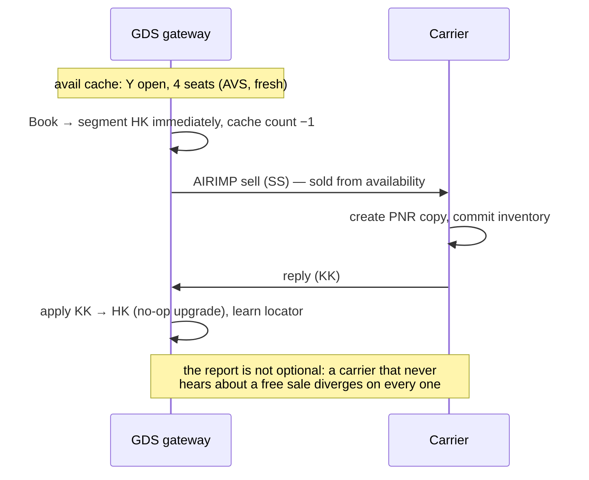
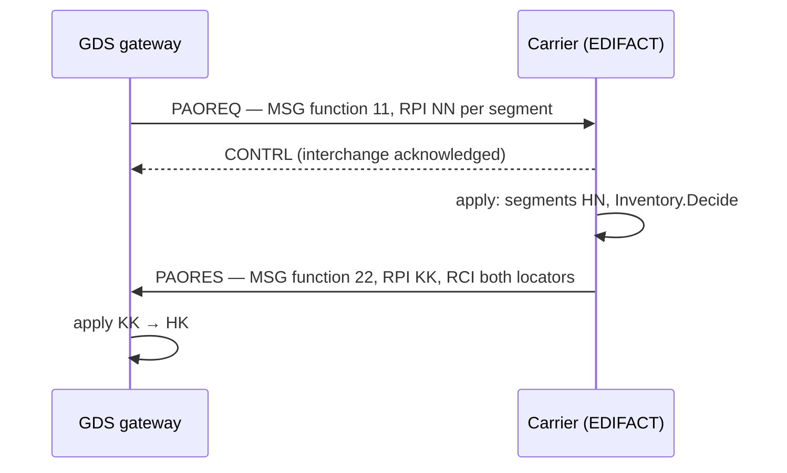
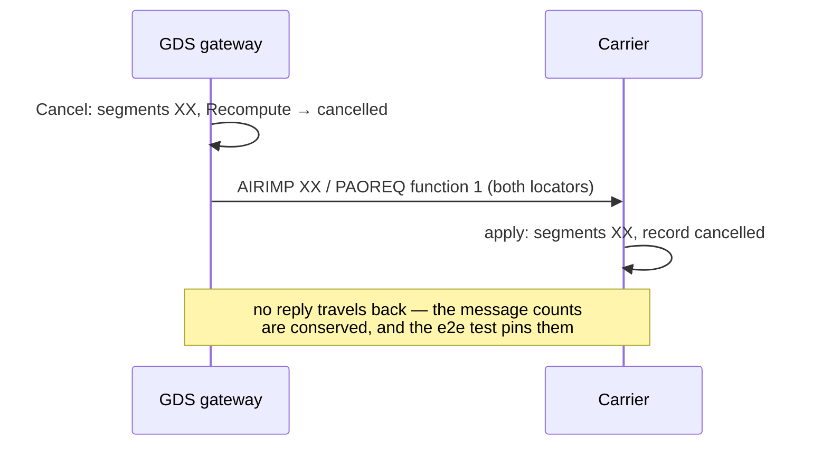
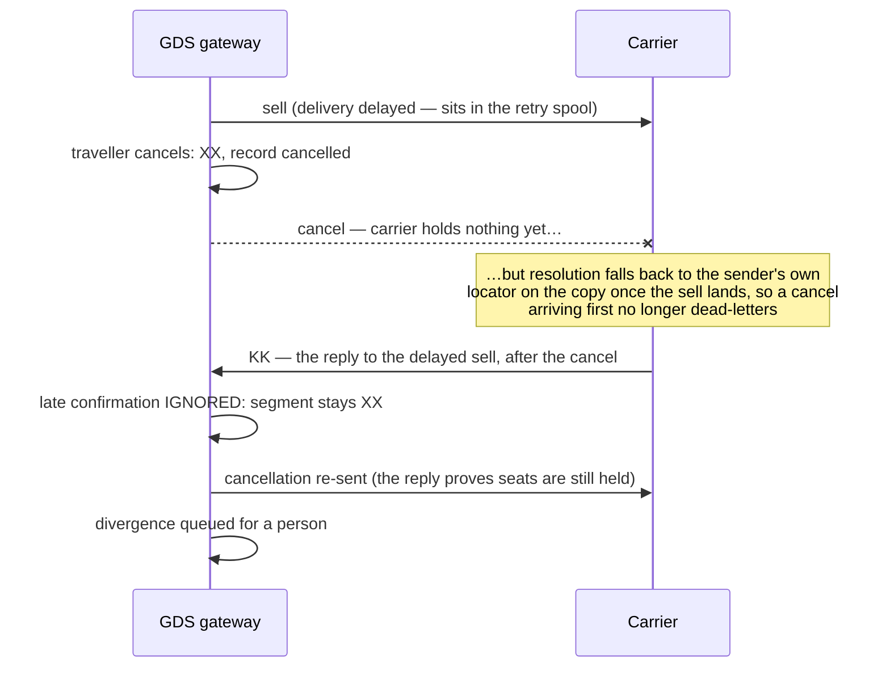
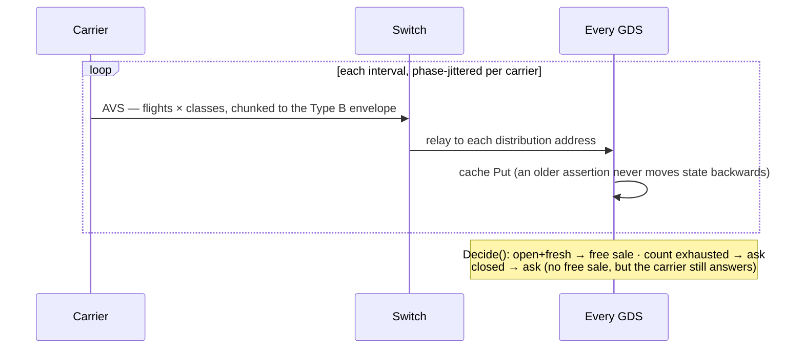
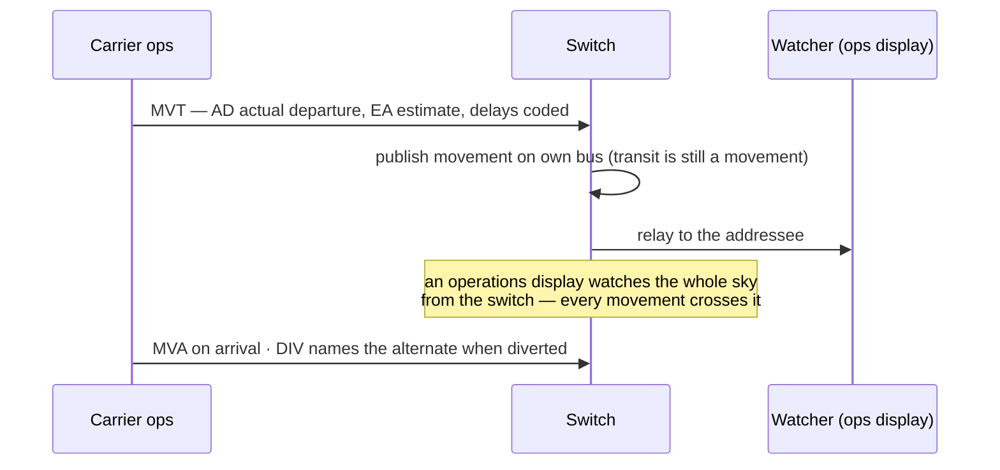
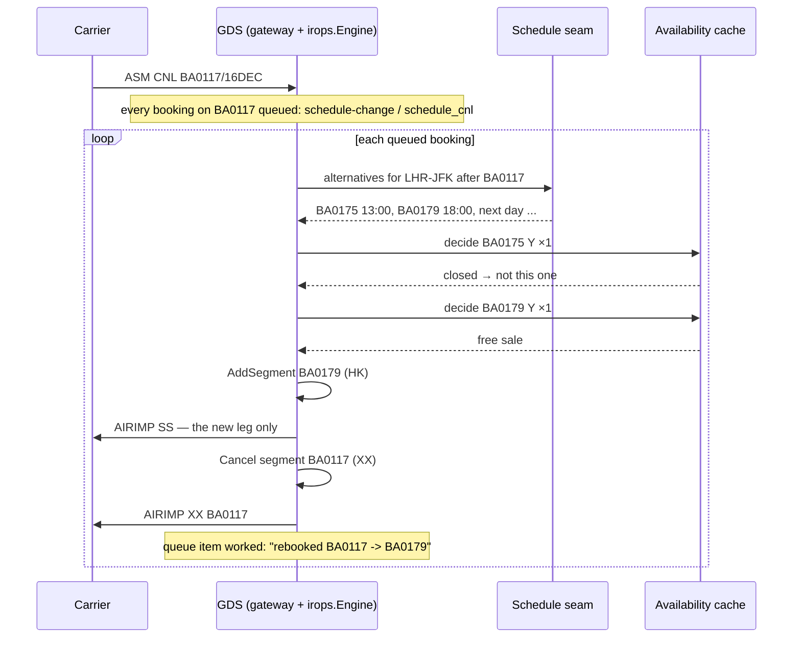
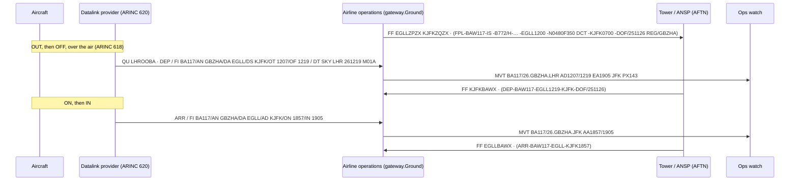

# Message flows

This document shows which participant sends each message, and in what order.
The participants are a distribution system (GDS) that sells, a switch that
relays, and a carrier's reservation system that answers. On a switchless
topology the GDS and the carrier communicate directly. The flows do not
change, except that the middle column disappears.

## A Type B sell, requested

This is the cold-cache path. The GDS holds no availability assertion. It
therefore sends a request to the carrier.

```mermaid
sequenceDiagram
    participant A as Agent/API
    participant G as GDS gateway
    participant X as Switch (relay)
    participant C as Carrier

    A->>G: Book(request)
    G->>G: create PNR, segments HN
    G->>X: AIRIMP sell (NN) — QU carrier address
    X->>C: relay (address routing)
    C->>C: create PNR copy, segments HN
    C->>C: Inventory.Decide → KK / US / UC
    C->>X: AIRIMP reply (KK1, RLOC both locators)
    X->>G: relay
    G->>G: apply: HN→HK, learn carrier's locator
    Note over G,C: both stores now agree; AwaitingReply() is false
```

## A Type B sell, free sale

This is the warm-cache path. The carrier's AVS broadcast stated that the
class is open. The GDS therefore confirms the segment immediately and reports
the sale to the carrier.



## An EDIFACT sell

This is the same conversation on a different wire. PAOREQ carries the request
and PAORES carries the answer. CONTRL acknowledges the syntax separately from
the content.



## Cancellation

A cancellation is an advisory. It is not a request. The sender has already
cancelled, and the message does not ask the recipient to decide anything. On
EDIFACT a cancellation carries MSG function 1. An earlier version answered a
cancellation as if it were a sell, and the refusal revived a cancelled
booking (v0.1.6).



## Messages that cross on the network

Store-and-forward retries reorder deliveries. Traffic at volume revived
cancelled segments in 2 ways (v0.1.6, v0.1.20). There is a guard for each.



## Availability



## Schedule change

```mermaid
sequenceDiagram
    participant C as Carrier
    participant G as GDS gateway
    participant Q as Queues

    C->>G: ASM CNL BA0117/16DEC (via switch)
    G->>G: applySchedule: find every booking on the flight
    G->>Q: place schedule-change item per booking
    Note over Q: each item is a booking a person now has to rework;<br/>the map's halos are these placements, counted
```

## Movement



## Tickets and EMDs

```mermaid
sequenceDiagram
    participant G as GDS gateway
    participant C as Carrier (EDIFACT)

    G->>G: IssueTickets: documents + coupons on the record
    G->>C: TKCREQ — ticket control, per document
    C->>G: TKCRES
    Note over G,C: ticket control is EDIFACT-only; a teletype carrier<br/>not told is a queued divergence, not a silent gap
```

## Departure control

Reservations records who booked. Departure control records who flew. The name
list opens the flight at the airport. Check-in fills the flight. Closing the
door produces the messages that every downstream system uses.

Every arrow in the diagram is a Type B message. The departure control system
(DCS) is `pkg/dcs`. It connects to a carrier's node through `gateway.Ground`.

```mermaid
sequenceDiagram
    participant R as Reservations (carrier host)
    participant D as Departure control (pkg/dcs)
    participant S as Sortation (bags)
    participant A as Arrival station
    participant O as Operations / revenue

    Note over R,D: T−180 min
    R->>D: PNL — every booked party (locator, class, SSRs, TKNE)
    Note over D: flight opened: cabin from the aircraft type
    loop check-in
        D->>D: accept — seat, sequence number, bag tags
        D->>S: BSM per party with bags
    end
    R->>D: ADL — DEL / ADD / CHG since the PNL
    Note over D: a DEL of an accepted passenger is kept as an alert, not obeyed
    Note over D: T−45 check-in closes; standbys clear into free seats
    loop boarding
        D->>D: board
    end
    S->>D: BPM — what was loaded (unknown tags raise an alert)
    Note over D: T−10 door closes: listed → no-show, accepted → offloaded
    D->>S: BSM DEL for each offloaded passenger's bags
    D->>R: PFS — NOSHO / GOSHO / NOREC / OFFLD by name
    D->>A: PTM — connecting passengers and their bags
    D->>A: PSM — passengers needing assistance, with seats
    D->>A: LDM — passengers, hold weights, cabin split
    D->>A: CPM — which ULD sits where (containerised types)
    D->>O: ETL — boarded passengers and the documents they flew on
    Note over D: loadsheet: ZFW / TOW / LAW, index and %MAC, underload
    D->>O: MVT — departure with the boarded count
```

The DCS refuses some inputs by design. It refuses a PNL after acceptance has
begun (`ErrListAfterAccept`), and acceptance after check-in has closed unless
a supervisor forces it. It also refuses a seat that is already taken, and a
go-show when every seat is owed to a listed passenger. The ledger records each
refusal against the message as `rejected`, with the bytes intact.

Load control follows the AHM 560 method. The DCS computes passenger weight by
cabin zone. It splits the bags between the holds to bring the take-off centre
of gravity toward the middle of the envelope. It assigns ULDs to positions on
containerised aircraft. The loadsheet reports the limits that the DCS checked
it against.

## Irregular operations

A cancellation queues every booking that it touches (see Schedule change).
The irops engine works that queue for the common case.



If no alternative flight is open, the engine leaves the item on the queue for
a person. With `AskCarriers`, the engine instead requests a closed or unknown
flight and leaves the passenger holding an HN. That is a different promise to
the passenger. `AskCarriers` is off by default.

## The aircraft and the tower

There are 2 networks beside the airline's own network. The aircraft reports
its movements over its datalink. The datalink provider forwards the reports
to the airline as ARINC 620 messages on Type B. Operations derives the MVT
from the report. Air traffic services runs the AFTN. The airline files a
flight plan on the AFTN, and the towers send departure and arrival messages
when they observe the aircraft move.



The switch routes AFTN traffic by indicator. An addressee that carries a
carrier's 3-letter designator goes down that carrier's link, whatever the
location. Every other addressee goes to the link that is marked as the
aeronautical network.
