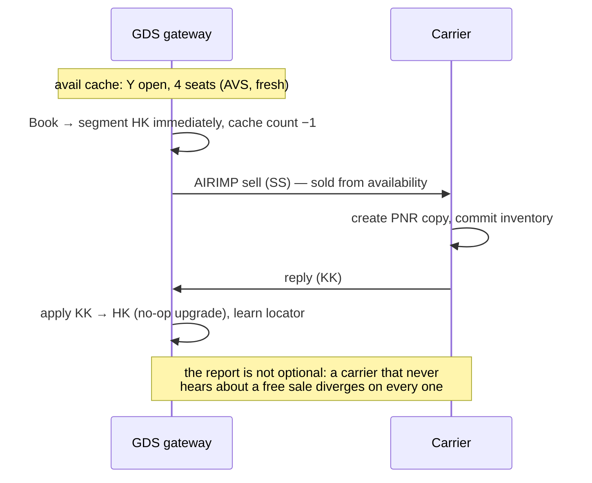
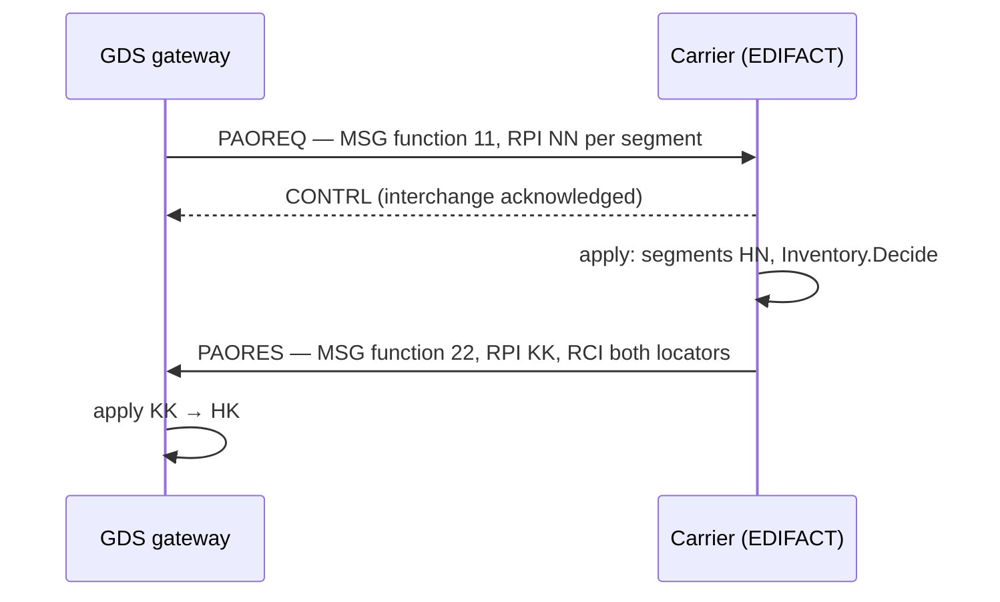
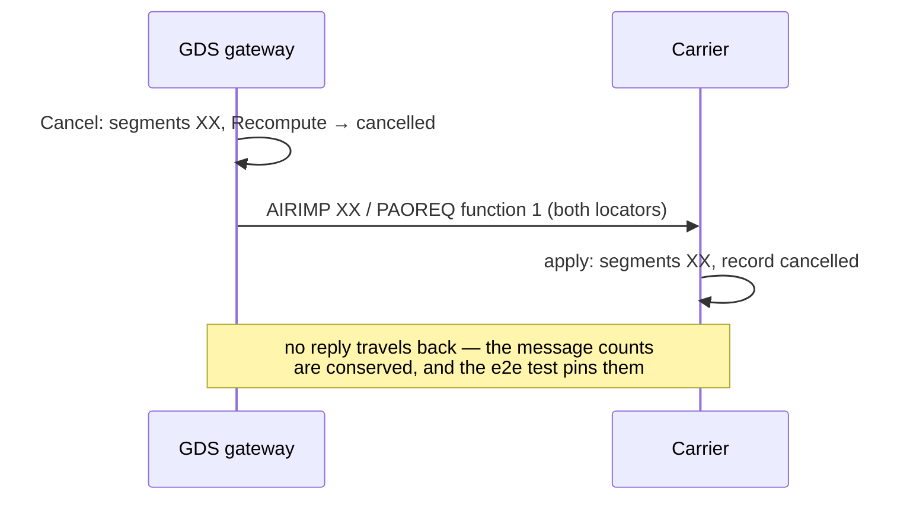
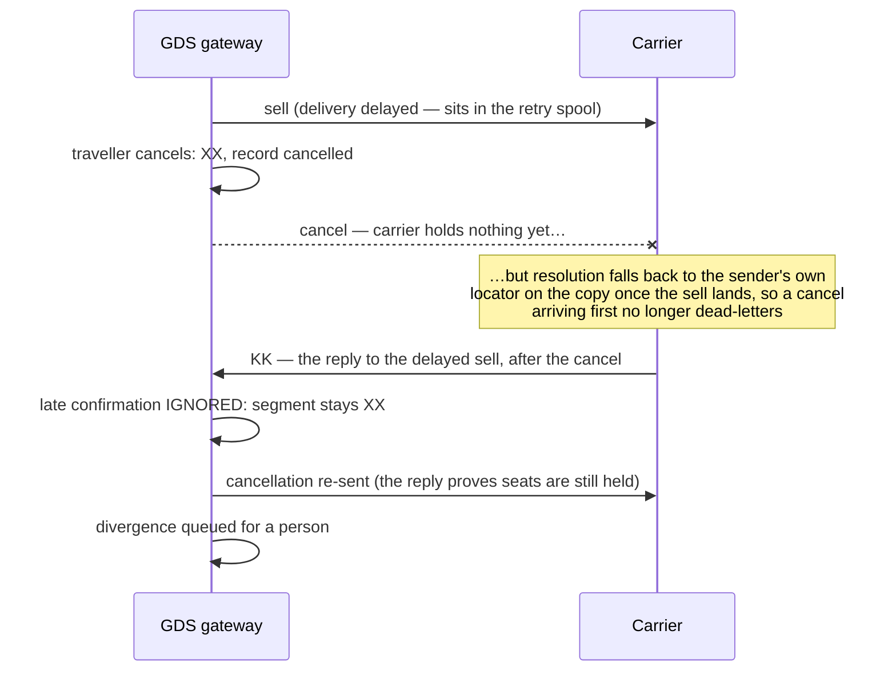
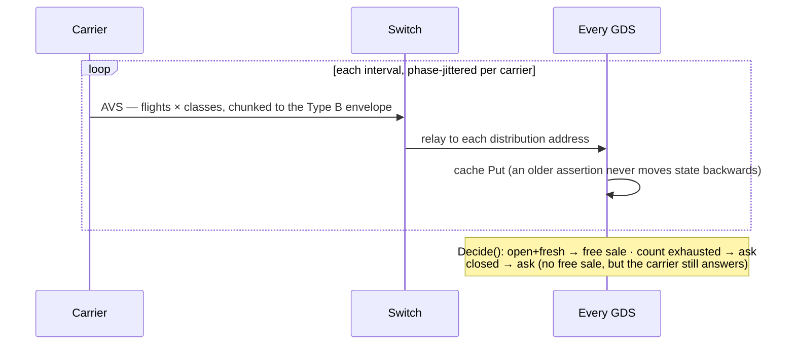
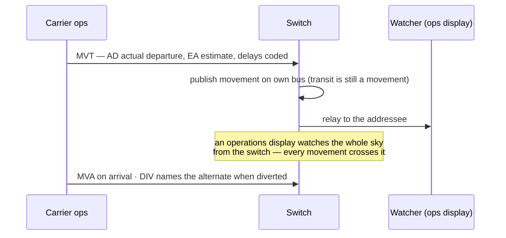
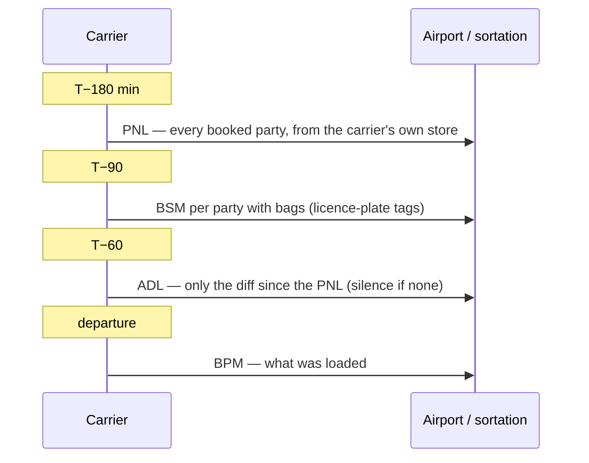

# Message flows

Who talks to whom, in what order. Participants are the roles a real network
has: a distribution system (GDS) that sells, a switch that relays, and a
carrier's reservation system that answers. On a switchless topology the GDS
and carrier talk directly; nothing in the flows changes but the middle
column disappearing.

## A Type B sell, requested

The cold-cache path: the GDS holds no availability assertion, so it asks.

```mermaid
sequenceDiagram
    participant A as Agent/API
    participant G as GDS gateway
    participant X as Switch (relay)
    participant C as Carrier

    A->>G: Book(request)
    G->>G: create PNR, segments HN
    G->>X: AIRIMP sell (NN) — QU carrier address
    X->>C: relay (address routing)
    C->>C: create PNR copy, segments HN
    C->>C: Inventory.Decide → KK / US / UC
    C->>X: AIRIMP reply (KK1, RLOC both locators)
    X->>G: relay
    G->>G: apply: HN→HK, learn carrier's locator
    Note over G,C: both stores now agree; AwaitingReply() is false
```

## A Type B sell, free sale

The warm-cache path: the carrier's AVS broadcast said the class is open, so
the GDS confirms on the spot and reports the sale it made.



## An EDIFACT sell

Same conversation, different wire: PAOREQ asks, PAORES answers, CONTRL
acknowledges syntax separately from content.



## Cancellation

A cancellation is an advisory, not a request: the sender has already
cancelled, and nothing in it asks the recipient to decide anything. On
EDIFACT it carries MSG function 1 — answering one as if it were a sell was
how a cancelled booking once got refused back to life (v0.1.6).



## Messages that cross on the network

Store-and-forward retries reorder deliveries. Two guards exist because real
volume found both resurrections (v0.1.6, v0.1.20).



## Availability



## Schedule change

```mermaid
sequenceDiagram
    participant C as Carrier
    participant G as GDS gateway
    participant Q as Queues

    C->>G: ASM CNL BA0117/16DEC (via switch)
    G->>G: applySchedule: find every booking on the flight
    G->>Q: place schedule-change item per booking
    Note over Q: each item is a booking a person now has to rework;<br/>the map's halos are these placements, counted
```

## Movement



## Tickets and EMDs

```mermaid
sequenceDiagram
    participant G as GDS gateway
    participant C as Carrier (EDIFACT)

    G->>G: IssueTickets: documents + coupons on the record
    G->>C: TKCREQ — ticket control, per document
    C->>G: TKCRES
    Note over G,C: ticket control is EDIFACT-only; a teletype carrier<br/>not told is a queued divergence, not a silent gap
```

## The ground story (wholesky's use of the name-list and bag packages)


