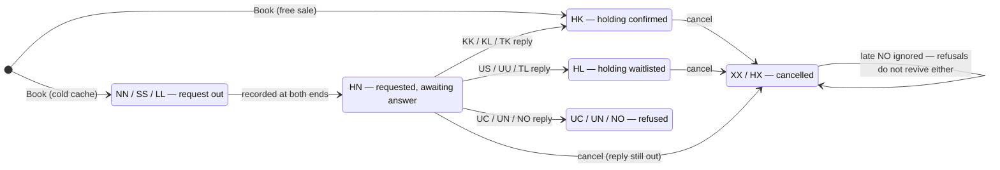
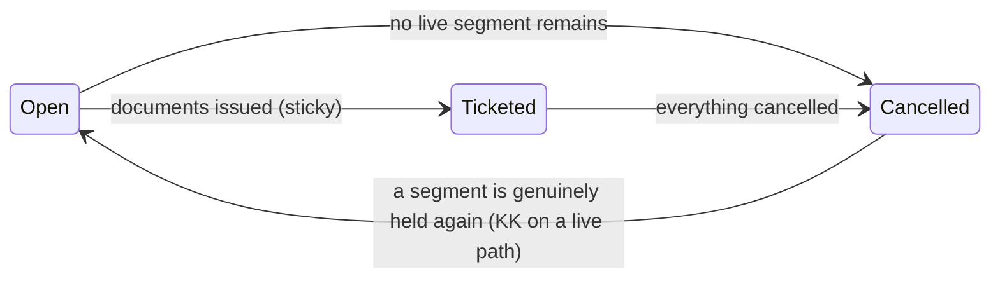
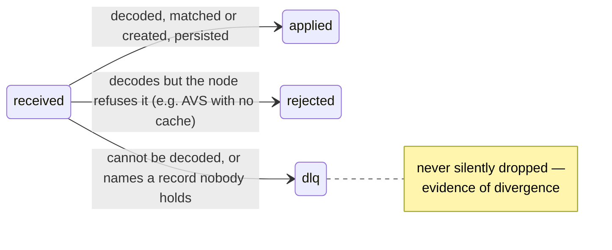
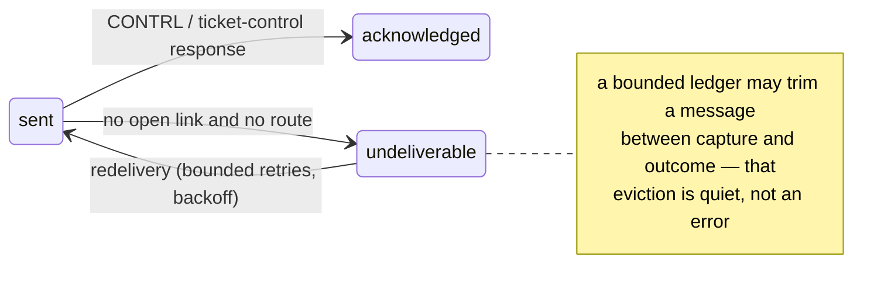
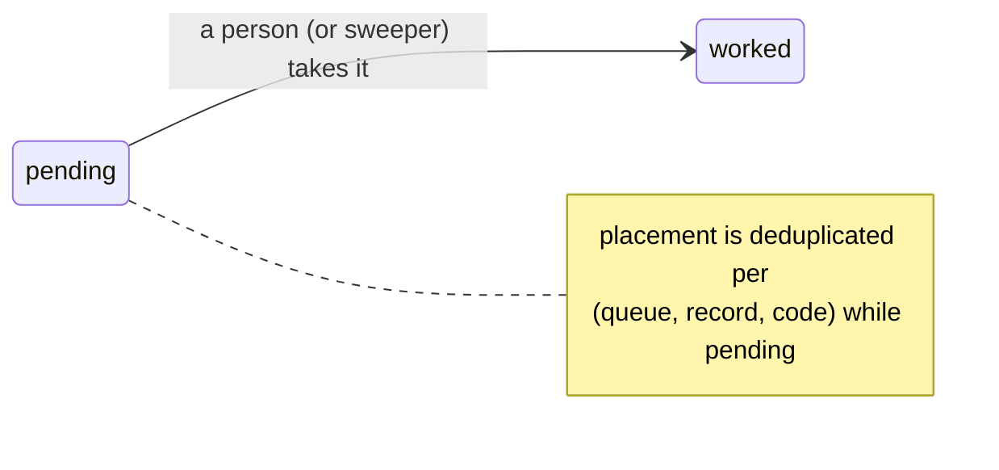
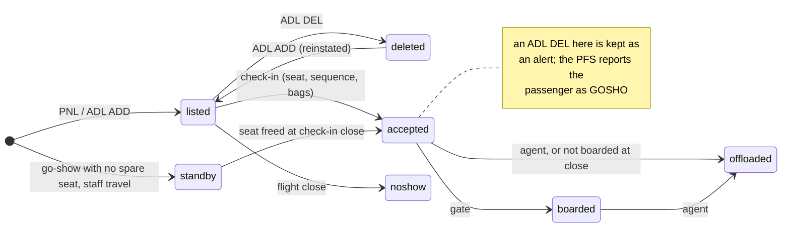
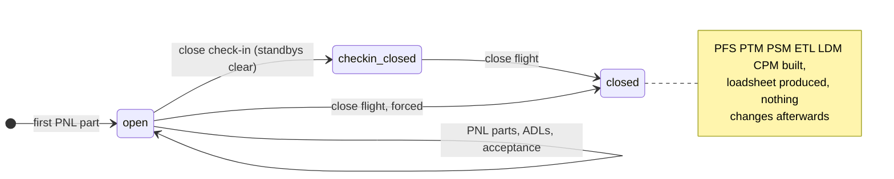

# State machines

The status vocabularies and their legal transitions. The segment codes are
the interline action/status vocabulary (`pkg/rescode`); everything else
derives from them.

## Segment status

A segment's status is an action code. The categories drive every decision:
requests expect replies, holdings state facts, cancellations and refusals
are dead ends, advice narrates schedule change.

Guards worth naming, each with a regression test behind it:

- **Refusals are not live** (v0.1.6): `Recompute` derives liveness from the
  category table. `NO` is exactly as dead as `XX`; a hand-written dead list
  once omitted it and a stray refusal reopened a cancelled record.
- **Late confirmations are ignored** (v0.1.20): a `KK` landing on an `XX`
  segment — replies and cancellations cross on a store-and-forward network
  — leaves the segment dead, queues a divergence, and re-sends the
  cancellation.
- **Unknown codes stay live**: a code we cannot read is not a reason to
  cancel somebody's booking.

## Record status

"Live" means the category table says so: holdings, pending requests, and
confirmed or waitlisted replies. Cancellations, refusals, and the advice
codes that say deleted are not; surface (ARNK) and auxiliary placeholders
never count. Ticketing is sticky — a ticketed record stays ticketed until
nothing on it lives.

## Inbound message pipeline

Resolution order for the record a message names: our own locator first;
then, for messages that amend rather than create, the partner's locator via
the external-locator index, scoped to the sending peer — a cancellation can
arrive before the reply that would have taught the sender our locator.

## Outbound message

## Queue item

The queues themselves say what kind of attention a record needs:
`confirmation` (a partner confirmed), `unable` (a partner could not),
`schedule-change` (a flight moved under a booking), `ticketing` (a time
limit approaches; the sweeper cancels on expiry only when asked), and
`divergence` — the queue for every case where two systems' views of one
booking are known to disagree.

## Passenger, at departure control

The PFS categories read straight off this chart: `NOSHO` is `listed →
noshow`, `OFFLD` is anything that reached `offloaded`, `GOSHO` and `NOREC`
are go-shows that flew, `IDPAD` is staff that cleared. A passenger who was
listed, accepted and boarded is not reported at all: the list was right.

## Flight, at departure control

