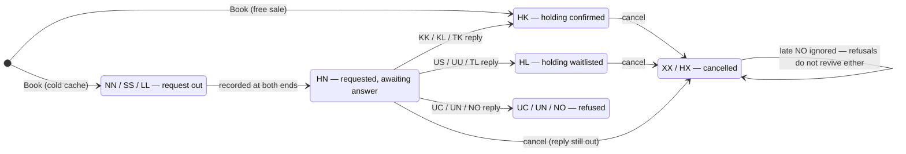
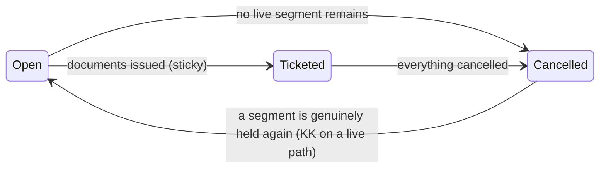
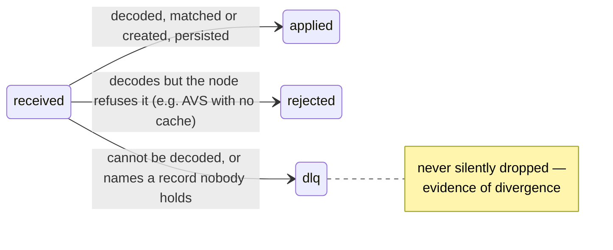
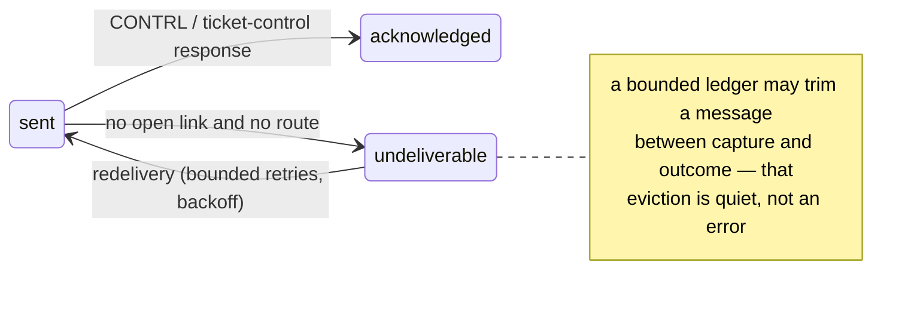
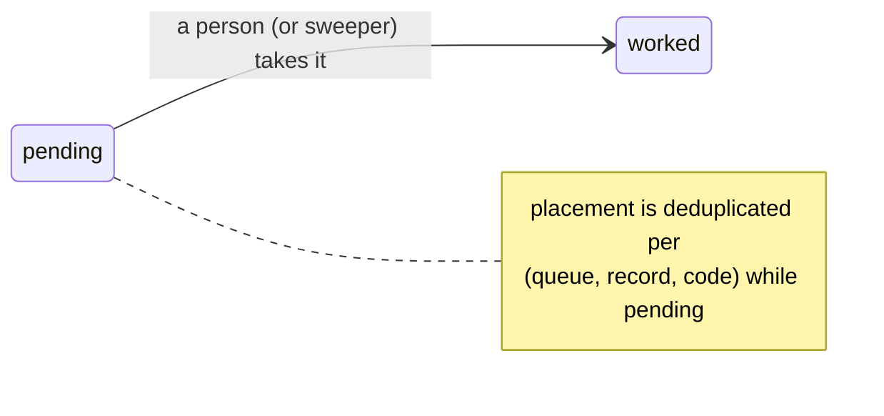
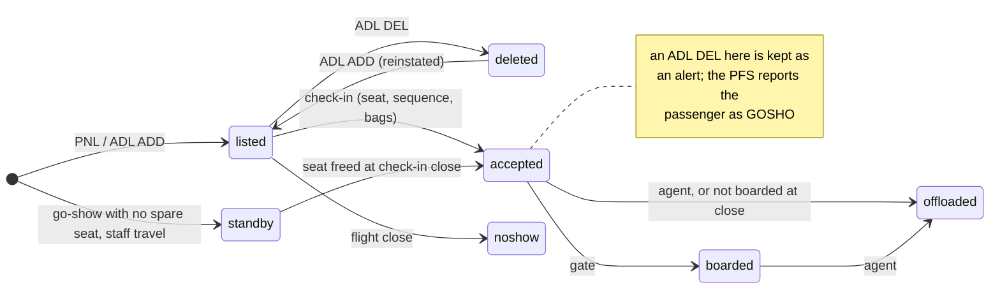
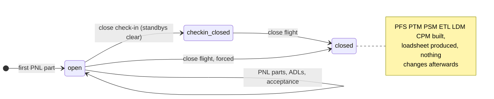

# State machines

This document lists the status vocabularies and their legal transitions. The
segment codes are the interline action/status vocabulary (`pkg/rescode`).
Every other status derives from them.

## Segment status

A segment's status is an action code. The code categories drive every
decision. A request expects a reply. A holding states a fact. A cancellation
or a refusal is a terminal state. An advice code describes a schedule change.

These guards each have a regression test:

- **Refusals are not live** (v0.1.6). `Recompute` derives liveness from the
  category table. `NO` is as dead as `XX`. A hand-written dead list once
  omitted `NO`, and a stray refusal reopened a cancelled record.
- **Late confirmations are ignored** (v0.1.20). Replies and cancellations
  cross on a store-and-forward network. A `KK` that lands on an `XX` segment
  leaves the segment dead, queues a divergence, and re-sends the
  cancellation.
- **Unknown codes stay live.** A code that we cannot read is not a reason to
  cancel somebody's booking.

## Record status

A segment is live when the category table says so. The live categories are
holdings, pending requests, and confirmed or waitlisted replies.
Cancellations, refusals, and the advice codes that mean deleted are not live.
Surface (ARNK) and auxiliary placeholders never count. Ticketing is sticky. A
ticketed record stays ticketed until no segment on it is live.

## Inbound message pipeline

The pipeline resolves the record that a message names in this order. It tries
our own locator first. Then, for messages that amend an existing record, it
tries the partner's locator through the external-locator index, scoped to the
sending peer. The second step exists because a cancellation can arrive before
the reply that would have given the sender our locator.

## Outbound message

## Queue item

The queue name states what kind of attention a record needs. `confirmation`
means a partner confirmed. `unable` means a partner could not. `schedule-change`
means a flight moved under a booking. `ticketing` means a time limit
approaches, and on that queue the sweeper cancels on expiry only when asked.
`divergence` is the queue for every case where 2 systems' views of one booking
are known to disagree.

## Passenger, at departure control

The PFS categories map directly onto this chart. `NOSHO` is `listed →
noshow`. `OFFLD` is any passenger who reached `offloaded`. `GOSHO` and
`NOREC` are go-shows who flew. `IDPAD` is staff who cleared. A passenger who
was listed, accepted and boarded is not reported, because the list was right.

## Flight, at departure control

